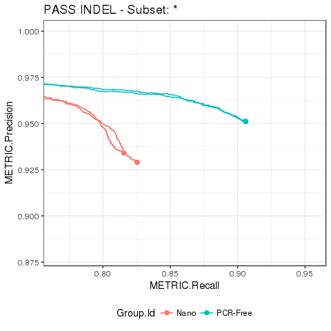
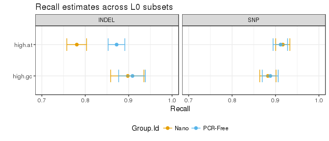

happyCompare
============

[](https://travis-ci.org/Illumina/happyCompare) [](https://codecov.io/github/Illumina/happyCompare?branch=master)

happyCompary offers a set of functions to facilitate downstream analysis of variant calling performance outputs from [hap.py](https://github.com/Illumina/hap.py). It builds on top of [happyR](https://github.com/Illumina/happyR) to support annotation of hap.py results (e.g. grouping) through metadata samplesheets, and provides methods for quick retrieval, statistical analysis and easy reporting of performance metrics.

Install
-------

Download [zip](https://git.illumina.com/Bioinformatics/happyCompare/archive/master.zip), extract and run:

``` r
devtools::install_local("path/to/happyCompare-master/")
```

Usage
-----

``` r
library("happyCompare")
## Warning: Installed Rcpp (0.12.12) different from Rcpp used to build dplyr (0.12.11).
## Please reinstall dplyr to avoid random crashes or undefined behavior.

# loading demo data from a happyCompare samplesheet creates a happy_compare object...
samplesheet_path <- system.file("extdata/samplesheets", "pcrfree_vs_nano.readme.csv", package = "happyCompare")
happy_compare <- read_samplesheet(samplesheet_path, lazy = TRUE)
class(happy_compare)
## [1] "happy_compare"

# ... that contains the following fields:
# - samplesheet: the original samplesheet
# - happy_results: a list of happy_result objects as defined in happyR
# - ids: a vector of build ids
sapply(happy_compare, class)
## $samplesheet
## [1] "tbl_df"     "tbl"        "data.frame"
## 
## $happy_results
## [1] "happy_result_list"
## 
## $ids
## [1] "character"

# hap.py results and samplesheet metadata can be accessed with extract_metrics(),
# leaving them ready for downstream analysis
e <- extract_metrics(happy_compare, table = "summary")
class(e)
## [1] "happy_summary" "tbl_df"        "tbl"           "data.frame"
```

Example visualisations
----------------------

### Summary of performance metrics

``` r
# we can easily extract performance metrics and tabulate mean plus/minus SD 
# per group and variant type
extract_metrics(happy_compare, table = "summary") %>% 
  filter(Filter == "PASS") %>% 
  hc_summarise_metrics(df = ., group_cols = c("Group.Id", "Type")) %>% 
  knitr::kable()
```

| Group.Id | Type  | METRIC.F1\_Score | METRIC.Frac\_NA | METRIC.Precision | METRIC.Recall  |
|:---------|:------|:-----------------|:----------------|:-----------------|:---------------|
| Nano     | INDEL | 0.8725 ± 0.0024  | 0.3428 ± 0.0078 | 0.9315 ± 0.0036  | 0.8205 ± 0.007 |
| Nano     | SNP   | 0.9707 ± 2e-04   | 0.1425 ± 0.0016 | 0.9963 ± 4e-04   | 0.9465 ± 1e-04 |
| PCR-Free | INDEL | 0.928 ± 1e-04    | 0.3931 ± 0.0018 | 0.9512 ± 2e-04   | 0.9059 ± 1e-04 |
| PCR-Free | SNP   | 0.9697 ± 4e-04   | 0.1325 ± 0.0016 | 0.9968 ± 1e-04   | 0.9441 ± 8e-04 |

### Precision-recall curves

``` r
# similarly, we can extract roc metrics and plot a precision-recall curve for PASS INDEL
extract_metrics(happy_compare, table = "pr.all") %>% 
  hc_plot_roc(happy_roc = ., type = "INDEL", filter = "PASS")
```



### Stratified counts

``` r
# finally, we can extract stratified counts and estimate highest density intervals 
# for recall in level 0 subsets...
hdi <- extract_metrics(happy_compare, table = "extended") %>% 
  filter(Subtype == "*", Filter == "PASS", Subset.Level == 0, 
         Subset %in% c("high.at", "high.gc")) %>% 
  estimate_hdi(successes_col = "TRUTH.TP", totals_col = "TRUTH.TOTAL", 
               group_cols = c("Group.Id", "Subset", "Type"), aggregate_only = FALSE)

# ... and generate custom plots with ggplot2
hdi %>% 
  mutate(Subset = factor(Subset, levels = rev(unique(Subset)))) %>% 
  filter(replicate_id == ".aggregate") %>% 
  ggplot(aes(x = estimated_p, y = Subset, group = Subset)) +
    geom_point(aes(color = Group.Id), size = 2) +
    geom_errorbarh(aes(xmin = lower, xmax = upper, color = Group.Id), height = 0.4) +
    facet_grid(. ~ Type) +
    scale_colour_manual(values = c("#E69F00", "#56B4E9")) +
    theme(legend.position = "bottom") +
    ggtitle("Recall estimates across L0 subsets") +
    xlab("Recall") +
    ylab("") +
    xlim(0.7, 1)
```



System requirements
-------------------

### Hardware, OS and R

Development and testing for `happyCompare` have been done using R 3.3.3 on a Centos 6.9 machine, with 2 processor cores and 8GB of RAM. Alternative systems are also supported as documented in the official [R installation guide](https://cran.r-project.org/doc/manuals/r-release/R-admin.html).

### R session info

``` r
devtools::session_info()
```

    ## Session info -------------------------------------------------------------

    ##  setting  value                       
    ##  version  R version 3.3.3 (2017-03-06)
    ##  system   x86_64, linux-gnu           
    ##  ui       X11                         
    ##  language (EN)                        
    ##  collate  en_US.UTF-8                 
    ##  tz       <NA>                        
    ##  date     2017-08-17

    ## Packages -----------------------------------------------------------------

    ##  package      * version    date       source                       
    ##  assertthat     0.2.0      2017-04-11 CRAN (R 3.3.3)               
    ##  backports      1.1.0      2017-05-22 CRAN (R 3.3.3)               
    ##  base         * 3.3.3      2017-03-08 local                        
    ##  bindr          0.1        2016-11-13 cran (@0.1)                  
    ##  bindrcpp     * 0.2        2017-06-17 cran (@0.2)                  
    ##  broom          0.4.2      2017-02-13 CRAN (R 3.3.3)               
    ##  cellranger     1.1.0      2016-07-27 CRAN (R 3.3.3)               
    ##  colorspace     1.3-2      2016-12-14 CRAN (R 3.3.3)               
    ##  datasets     * 3.3.3      2017-03-08 local                        
    ##  devtools       1.13.1     2017-05-13 CRAN (R 3.3.3)               
    ##  digest         0.6.12     2017-01-27 CRAN (R 3.3.3)               
    ##  dplyr        * 0.7.0      2017-06-09 cran (@0.7.0)                
    ##  evaluate       0.10.1     2017-06-24 cran (@0.10.1)               
    ##  forcats        0.2.0      2017-01-23 CRAN (R 3.3.3)               
    ##  foreign        0.8-67     2016-09-13 CRAN (R 3.3.3)               
    ##  ggplot2      * 2.2.1      2016-12-30 CRAN (R 3.3.3)               
    ##  glue           1.1.1      2017-06-21 cran (@1.1.1)                
    ##  graphics     * 3.3.3      2017-03-08 local                        
    ##  grDevices    * 3.3.3      2017-03-08 local                        
    ##  grid           3.3.3      2017-03-08 local                        
    ##  gtable         0.2.0      2016-02-26 CRAN (R 3.3.3)               
    ##  happyCompare * 1.0.0      2017-08-16 local                        
    ##  happyR         0.1.0      2017-08-15 local (@5b26996)             
    ##  haven          1.0.0      2016-09-23 CRAN (R 3.3.3)               
    ##  HDInterval     0.1.3      2016-05-13 CRAN (R 3.3.3)               
    ##  highr          0.6        2016-05-09 CRAN (R 3.3.3)               
    ##  hms            0.3        2016-11-22 CRAN (R 3.3.3)               
    ##  htmltools      0.3.6      2017-04-28 CRAN (R 3.3.3)               
    ##  httr           1.2.1      2016-07-03 CRAN (R 3.3.3)               
    ##  jsonlite       1.5        2017-06-01 CRAN (R 3.3.3)               
    ##  knitr          1.16       2017-05-18 CRAN (R 3.3.3)               
    ##  labeling       0.3        2014-08-23 CRAN (R 3.3.3)               
    ##  lattice        0.20-34    2016-09-06 CRAN (R 3.3.3)               
    ##  lazyeval       0.2.0      2016-06-12 CRAN (R 3.3.3)               
    ##  lubridate      1.6.0      2016-09-13 CRAN (R 3.3.3)               
    ##  magrittr       1.5        2014-11-22 CRAN (R 3.3.3)               
    ##  memoise        1.1.0      2017-04-21 CRAN (R 3.3.3)               
    ##  methods      * 3.3.3      2017-03-08 local                        
    ##  mnormt         1.5-5      2016-10-15 CRAN (R 3.3.3)               
    ##  modelr         0.1.0      2016-08-31 CRAN (R 3.3.3)               
    ##  munsell        0.4.3      2016-02-13 CRAN (R 3.3.3)               
    ##  nlme           3.1-131    2017-02-06 CRAN (R 3.3.3)               
    ##  parallel       3.3.3      2017-03-08 local                        
    ##  pkgconfig      2.0.1      2017-03-21 cran (@2.0.1)                
    ##  plyr           1.8.4      2016-06-08 CRAN (R 3.3.3)               
    ##  psych          1.7.5      2017-05-03 CRAN (R 3.3.3)               
    ##  purrr        * 0.2.2.2    2017-05-11 CRAN (R 3.3.3)               
    ##  R6             2.2.2      2017-06-17 cran (@2.2.2)                
    ##  Rcpp           0.12.12    2017-07-15 cran (@0.12.12)              
    ##  readr        * 1.1.1      2017-05-16 CRAN (R 3.3.3)               
    ##  readxl         1.0.0      2017-04-18 CRAN (R 3.3.3)               
    ##  reshape2       1.4.2      2016-10-22 CRAN (R 3.3.3)               
    ##  rlang          0.1.2.9000 2017-08-15 Github (hadley/rlang@0e62148)
    ##  rmarkdown      1.6        2017-06-15 cran (@1.6)                  
    ##  rprojroot      1.2        2017-01-16 CRAN (R 3.3.3)               
    ##  rvest          0.3.2      2016-06-17 CRAN (R 3.3.3)               
    ##  scales         0.4.1      2016-11-09 CRAN (R 3.3.3)               
    ##  stats        * 3.3.3      2017-03-08 local                        
    ##  stringi        1.1.5      2017-04-07 CRAN (R 3.3.3)               
    ##  stringr        1.2.0      2017-02-18 CRAN (R 3.3.3)               
    ##  tibble       * 1.3.3      2017-05-28 CRAN (R 3.3.3)               
    ##  tidyr        * 0.6.3      2017-05-15 CRAN (R 3.3.3)               
    ##  tidyverse    * 1.1.1      2017-01-27 CRAN (R 3.3.3)               
    ##  tools          3.3.3      2017-03-08 local                        
    ##  utils        * 3.3.3      2017-03-08 local                        
    ##  withr          1.0.2      2016-06-20 CRAN (R 3.3.3)               
    ##  xml2           1.1.1      2017-01-24 CRAN (R 3.3.3)               
    ##  yaml           2.1.14     2016-11-12 CRAN (R 3.3.3)
