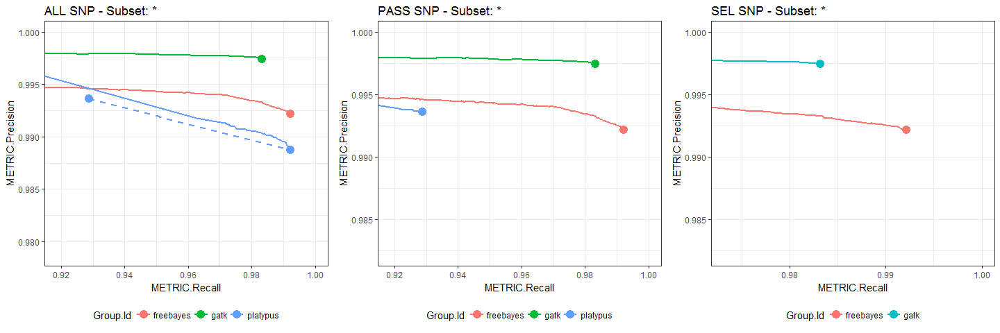

happyCompare
================

-   [Description](#description)
-   [Usage](#usage)
    -   [Interactive analyses](#interactive-analyses)
        -   [Load data into R](#load-data-into-r)
        -   [Extract tables of metrics](#extract-tables-of-metrics)
        -   [Reporting modules](#reporting-modules)
            -   [Obtain a summary of performance metrics](#obtain-a-summary-of-performance-metrics)
            -   [Plot a ROC curve for precision vs recall](#plot-a-roc-curve-for-precision-vs-recall)
    -   [Static reports](#static-reports)
-   [Demo datasets](#demo-datasets)
    -   [`happyCompare_list`](#happycompare_list)

Description
===========

A reporting toolbox for happy output.

Usage
=====

``` r
library(happyCompare)
```

Interactive analyses
--------------------

### Load data into R

We can easily load the results from set of hap.py outputs by creating a happyCompare samplesheet, e.g.:

    Group.Id,Sample.Id,Replicate.Id,happy_prefix
    freebayes,NA12878,NA12878_freebayes,output/freebayes
    gatk,NA12878,NA12878_gatk,output/gatk
    platypus,NA12878,NA12878_platypus,output/platypus

Then importing its contents into R:

``` r
## do not run
happyCompare_list = read_samplesheet(samplesheet_path = "happyCompare/happyCompare_samplesheet.csv")
```

``` r
# use pre-saved dataset from now on
load("data/happyCompare_list.RData")
```

The resulting `happyCompare_list` object contains the following fields:

-   `samplesheet`: the original samplesheet
-   `happy_results`: a list of `happy_result` objects as defined in `happyR`, with identifiers automatically set from samplesheet details

We can further explore the contents of `happyCompare_list` as we would with any other list, e.g.:

``` r
names(happyCompare_list)
```

    ## [1] "samplesheet"   "happy_results"

``` r
names(happyCompare_list$happy_results)
```

    ## [1] "freebayes-NA12878-NA12878_freebayes"
    ## [2] "gatk-NA12878-NA12878_gatk"          
    ## [3] "platypus-NA12878-NA12878_platypus"

``` r
names(happyCompare_list$happy_results[[1]])
```

    ## [1] "summary"  "extended" "pr_curve"

Alternatively, we can use `read_samplesheet_()` to create a `happyCompare_list` from its components:

``` r
# re-use from pre-loaded dataset
happy_results = happyCompare_list$happy_results
  
# modify samplesheet
samplesheet = happyCompare_list$samplesheet %>% 
  mutate(Group.Id = "Single group") %>% 
  select(Group.Id, Sample.Id, Replicate.Id, happy_prefix)
samplesheet
```

    ##       Group.Id Sample.Id      Replicate.Id     happy_prefix
    ## 1 Single group   NA12878 NA12878_freebayes output/freebayes
    ## 2 Single group   NA12878      NA12878_gatk      output/gatk
    ## 3 Single group   NA12878  NA12878_platypus  output/platypus

``` r
# set ids
ids = samplesheet %>% 
  mutate(.Id = paste(Group.Id, Sample.Id, Replicate.Id, sep = "-")) %>% 
  select(.Id) %>% 
  unlist()

# store as a new happyCompare_list
custom_hcl = read_samplesheet_(samplesheet = samplesheet, 
                               happy_results = happy_results,
                               ids = ids)
class(custom_hcl)
```

    ## [1] "happyCompare_list"

### Extract tables of metrics

The method `extract()` provides quick access to the nested results within our `happyCompare_list`, whilst preserving samplesheet metadata:

``` r
# inspect our object
names(happyCompare_list$happy_results[[1]])
```

    ## [1] "summary"  "extended" "pr_curve"

``` r
sapply(happyCompare_list$happy_results[[1]], class)
```

    ## $summary
    ## [1] "happy_summary" "tbl_df"        "tbl"           "data.frame"   
    ## 
    ## $extended
    ## [1] "happy_extended" "tbl_df"         "tbl"            "data.frame"    
    ## 
    ## $pr_curve
    ## [1] "list"

``` r
names(happyCompare_list$happy_results[[1]]$pr_curve)
```

    ## [1] "all"        "INDEL"      "INDEL_PASS" "INDEL_SEL"  "SNP"       
    ## [6] "SNP_PASS"   "SNP_SEL"

``` r
# extract a table with hap.py summary metrics
summary = extract(happyCompare_list, table = "summary")
str(summary)
```

    ## Classes 'happy_summary' and 'data.frame':    12 obs. of  22 variables:
    ##  $ .Id                      : chr  "freebayes-NA12878-NA12878_freebayes" "freebayes-NA12878-NA12878_freebayes" "freebayes-NA12878-NA12878_freebayes" "freebayes-NA12878-NA12878_freebayes" ...
    ##  $ Group.Id                 : Factor w/ 3 levels "freebayes","gatk",..: 1 1 1 1 2 2 2 2 3 3 ...
    ##  $ Sample.Id                : Factor w/ 1 level "NA12878": 1 1 1 1 1 1 1 1 1 1 ...
    ##  $ Replicate.Id             : Factor w/ 3 levels "NA12878_freebayes",..: 1 1 1 1 2 2 2 2 3 3 ...
    ##  $ happy_prefix             : Factor w/ 3 levels "output/freebayes",..: 1 1 1 1 2 2 2 2 3 3 ...
    ##  $ Type                     : chr  "INDEL" "INDEL" "SNP" "SNP" ...
    ##  $ Filter                   : chr  "ALL" "PASS" "ALL" "PASS" ...
    ##  $ TRUTH.TOTAL              : int  9126 9126 51016 51016 9126 9126 51016 51016 9126 9126 ...
    ##  $ TRUTH.TP                 : int  7451 7451 50617 50617 8532 8532 50157 50156 8704 6122 ...
    ##  $ TRUTH.FN                 : int  1675 1675 399 399 594 594 859 860 422 3004 ...
    ##  $ QUERY.TOTAL              : int  11163 11163 74716 74716 14509 14483 70641 70551 16793 7675 ...
    ##  $ QUERY.FP                 : int  686 686 398 398 367 366 130 130 468 192 ...
    ##  $ QUERY.UNK                : int  2991 2991 23748 23748 5401 5376 20405 20316 7409 1261 ...
    ##  $ FP.gt                    : int  278 278 66 66 18 18 60 60 34 15 ...
    ##  $ METRIC.Recall            : num  0.816 0.816 0.992 0.992 0.935 ...
    ##  $ METRIC.Precision         : num  0.916 0.916 0.992 0.992 0.96 ...
    ##  $ METRIC.Frac_NA           : num  0.268 0.268 0.318 0.318 0.372 ...
    ##  $ METRIC.F1_Score          : num  0.863 0.863 0.992 0.992 0.947 ...
    ##  $ TRUTH.TOTAL.TiTv_ratio   : num  NA NA 2.08 2.08 NA ...
    ##  $ QUERY.TOTAL.TiTv_ratio   : num  NA NA 1.79 1.79 NA ...
    ##  $ TRUTH.TOTAL.het_hom_ratio: num  1.42 1.42 1.59 1.59 1.42 ...
    ##  $ QUERY.TOTAL.het_hom_ratio: num  1.34 1.34 2.1 2.1 1.95 ...

``` r
# extract a table with hap.py roc metrics
roc = extract(happyCompare_list, table = "pr_curve.SNP_PASS")
class(roc)
```

    ## [1] "happy_roc"  "data.frame"

``` r
names(roc) %>% head(n = 12)
```

    ##  [1] ".Id"          "Group.Id"     "Sample.Id"    "Replicate.Id"
    ##  [5] "happy_prefix" "Type"         "Subtype"      "Subset"      
    ##  [9] "Filter"       "Genotype"     "QQ.Field"     "QQ"

From here, we can continue the analysis with custom R functions or by using the reporting modules provided.

### Reporting modules

#### Obtain a summary of performance metrics

We can use the method `tabulate()` to display a summary of performance metrics as a formatted table, e.g.:

``` r
cols = c("Group.Id", "Replicate.Id", "METRIC.Recall", "METRIC.Precision", "METRIC.Frac_NA", "METRIC.F1_Score")
colnames = c("Group.Id", "Sample", "Recall", "Precision", "Frac_NA", "F1_Score")

# 1 replicate per group
s = extract(happyCompare_list, table = "summary")
t = tabulate(happy_summary = s, cols = cols, colnames = colnames, 
             filter = "PASS", vartype = "SNP", aggregate = FALSE)
t %>% knitr::kable()
```

| Group.Id  | Sample             |    Recall|  Precision|  Frac\_NA|  F1\_Score|
|:----------|:-------------------|---------:|----------:|---------:|----------:|
| freebayes | NA12878\_freebayes |  0.992179|   0.992191|  0.317844|   0.992185|
| gatk      | NA12878\_gatk      |  0.983143|   0.997412|  0.287962|   0.990226|
| platypus  | NA12878\_platypus  |  0.928767|   0.993601|  0.092894|   0.960091|

``` r
# multiple replicates
s = extract(custom_hcl, table = "summary")
t = tabulate(happy_summary = s, cols = cols, colnames = colnames, 
             filter = "PASS", vartype = "SNP", aggregate = TRUE)
t %>% knitr::kable()
```

| Group.Id     |    N| Recall         | Precision       | Frac\_NA        | F1\_Score      |
|:-------------|----:|:---------------|:----------------|:----------------|:---------------|
| Single group |    3| 0.968 ± 0.0343 | 0.9944 ± 0.0027 | 0.2329 ± 0.1222 | 0.9808 ± 0.018 |

#### Plot a ROC curve for precision vs recall

We can visualise precision-recall ROC curves by passing `happy_roc` objects to `plot()`:

``` r
roc = extract(happyCompare_list, table = "pr_curve.all")
class(roc)
```

    ## [1] "happy_roc"  "data.frame"

``` r
p1 = plot(roc, type = "SNP", filter = "ALL")  
p2 = plot(roc, type = "SNP", filter = "PASS")
p3 = plot(roc, type = "SNP", filter = "SEL")

ggplot2::theme_set(theme_bw())
gridExtra::grid.arrange(p1, p2, p3, nrow = 1)
```



The plots above display one ROC curve per replicate, colored by group. The PASS point is also highlighted. Note how in the first plot, which displays ALL SNPs, the PASS point for the blue dataset does not overlap with the ALL ROC curve, as emphasised by the connector line that links it to the end of the ROC curve.

Static reports
--------------

It is also possible to wrap happyCompare functionality into custom Rmd reports, as illustrated below.

**Example germline report:** [germline.html](inst/examples/germline.html)

``` bash
DATA="C:/Users/mgonzalez/SublimeProjects/happy-example-data"
HAPPYCOMPARE="C:/Users/mgonzalez/SublimeProjects/happyCompare"
RESULTS_ROOT="C:/Users/mgonzalez/SublimeProjects/happy-example-data"
Rscript --vanilla $HAPPYCOMPARE/exec/happyCompare.R \
        --input_template $HAPPYCOMPARE/inst/rmd/germline.Rmd \
        --output_dir $HAPPYCOMPARE/inst/examples \
        --samplesheet $DATA/happyCompare/happyCompare_samplesheet.csv \
        --root_dir $RESULTS_ROOT
```

    ## [DONE] Output: C:/Users/mgonzalez/SublimeProjects/happyCompare/inst/examples

Demo datasets
=============

`happyCompare_list`
-------------------

A demo `happyCompare_list` object, obtained by running hap.py on hap.py example data and loading the results into R using `happyCompare::read_samplesheet()`.

**Step 1: run hap.py**

    $HAPPY_ROOT=/path/to/hap.py/repo/root
    $HAPPY_BIN=/path/to/hap.py/binnary

    # fixed hap.py resources
    truth=$HAPPY_ROOT/example/happy/PG_NA12878_hg38-chr21.vcf.gz
    conf=$HAPPY_ROOT/example/happy/PG_Conf_hg38-chr21.bed.gz
    ref=$HAPPY_ROOT/example/happy/hg38.chr21.fa

    # query VCFs
    gatk_q=$HAPPY_ROOT/example/happy/NA12878-GATK3-chr21.vcf.gz
    freebayes_q=$HAPPY_ROOT/example/happy/NA12878-Freebayes-chr21.vcf.gz
    platypus_q=$HAPPY_ROOT/example/happy/NA12878-Platypus-chr21.vcf.gz

    # run hap.py
    mkdir -p $outdir
    $HAPPY_BIN -f $conf -r $ref --no-json $truth $gatk_q --roc-filter LowQual --roc QUAL -o $outdir/gatk
    $HAPPY_BIN -f $conf -r $ref --no-json $truth $freebayes_q --roc-filter LowQual --roc QUAL -o $outdir/freebayes
    $HAPPY_BIN -f $conf -r $ref --no-json $truth $platypus_q --roc QUAL -o $outdir/platypus

**Step 2: Create a happyCompare samplesheet**

    Group.Id,Sample.Id,Replicate.Id,happy_prefix
    freebayes,NA12878,NA12878_freebayes,output/freebayes
    gatk,NA12878,NA12878_gatk,output/gatk
    platypus,NA12878,NA12878_platypus,output/platypus

**Step 3: Load data into R**

``` r
library(happyCompare)

happyCompare_list = read_samplesheet(samplesheet_path = "happyCompare/happyCompare_samplesheet.csv")
save(happyCompare_list, file = "happyCompare/happyCompare_list.RData")
```
