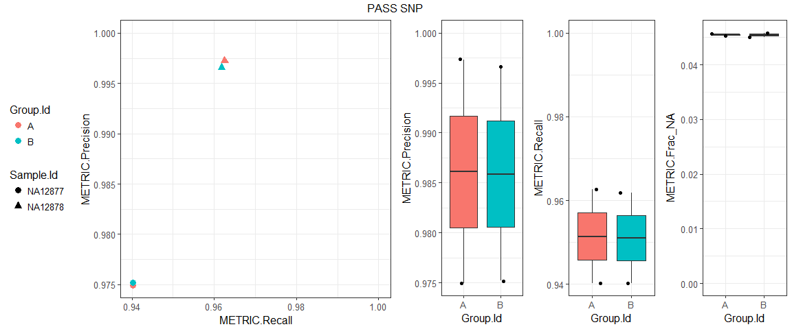
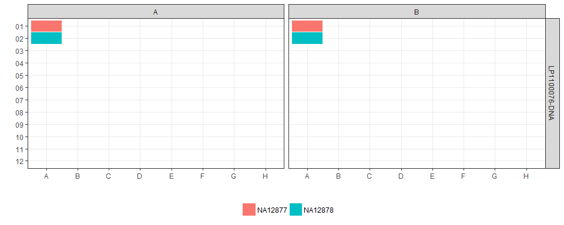
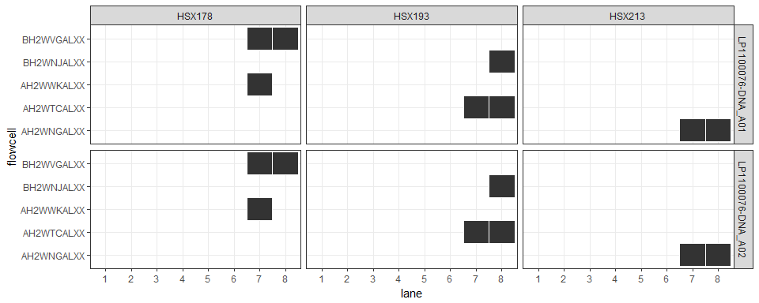
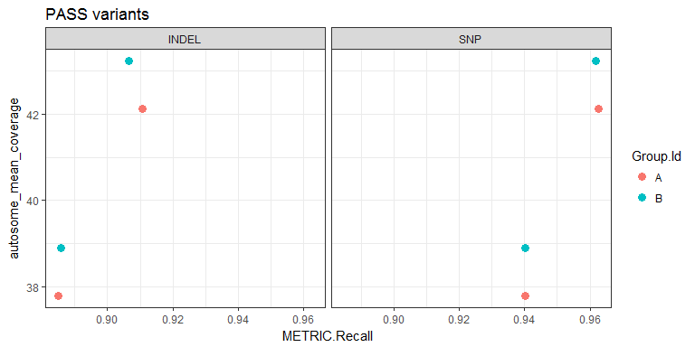
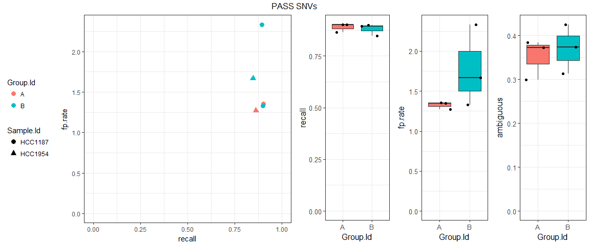
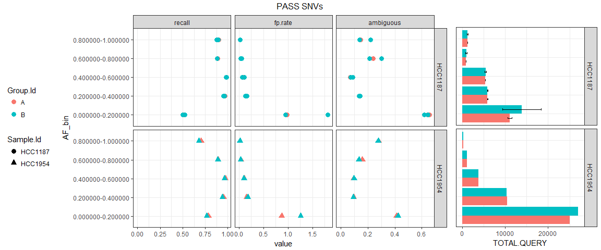

haploCompare examples
================

-   [Set up](#set-up)
-   [Germline workflow](#germline-workflow)
    -   [`happy_summary`](#happy_summary)
    -   [`happy_extended`](#happy_extended)
    -   [`build_metrics`](#build_metrics)
    -   [Metadata](#metadata)
-   [Somatic workflow](#somatic-workflow)
    -   [`sompy_stats`](#sompy_stats)

Set up
------

``` r
library("happyCompare")
library("ggplot2")
theme_set(theme_bw())
library("dplyr")
library("data.table")
source("../../R/util.R")
```

Germline workflow
-----------------

**Inspect the pre-loaded dataset**

``` r
class(demo_haplocompare_germline)
```

    ## [1] "haplocompare" "list"

``` r
!sapply(demo_haplocompare_germline, is.null)
```

    ##         config  happy_summary happy_extended    sompy_stats  build_metrics 
    ##           TRUE           TRUE           TRUE          FALSE           TRUE

``` r
print(demo_haplocompare_germline)
```

    ## $config
    ## [1] "data.table" "data.frame"
    ## 
    ## $happy_summary
    ## [1] "happy_summary" "list"         
    ## 
    ## $happy_extended
    ## [1] "happy_extended" "list"          
    ## 
    ## $sompy_stats
    ## [1] "NULL"
    ## 
    ## $build_metrics
    ## [1] "build_metrics" "list"

### `happy_summary`

**Inspect `happy_summary` results**

``` r
hs = demo_haplocompare_germline$happy_summary
class(hs)
```

    ## [1] "happy_summary" "list"

``` r
head(hs)
```

    ## $`A-NA12877-LP1100076-DNA_A01`
    ##     Type Filter TRUTH.TOTAL TRUTH.TP TRUTH.FN QUERY.TOTAL QUERY.FP
    ## 1: INDEL    ALL      612157   546848    65309      942942    65406
    ## 2: INDEL   PASS      612157   541671    70486      847432    43010
    ## 3:   SNP    ALL     3641960  3464412   177548     3908358   106634
    ## 4:   SNP   PASS     3641960  3424300   217660     3681503    88081
    ##    QUERY.UNK FP.gt METRIC.Recall METRIC.Precision METRIC.Frac_NA
    ## 1:    318975 19962      0.893313         0.895177       0.338276
    ## 2:    252159 15841      0.884856         0.927747       0.297557
    ## 3:    335951 87465      0.951249         0.970151       0.085957
    ## 4:    167896 78588      0.940235         0.974931       0.045605
    ##    TRUTH.TOTAL.TiTv_ratio QUERY.TOTAL.TiTv_ratio TRUTH.TOTAL.het_hom_ratio
    ## 1:                     NA                     NA                  1.794886
    ## 2:                     NA                     NA                  1.794886
    ## 3:               2.059127               1.974661                  1.549689
    ## 4:               2.059127               2.051510                  1.549689
    ##    QUERY.TOTAL.het_hom_ratio Group.Id Sample.Id      Replicate.Id
    ## 1:                  2.423326        A   NA12877 LP1100076-DNA_A01
    ## 2:                  2.106032        A   NA12877 LP1100076-DNA_A01
    ## 3:                  1.715270        A   NA12877 LP1100076-DNA_A01
    ## 4:                  1.650620        A   NA12877 LP1100076-DNA_A01
    ## 
    ## $`A-NA12878-LP1100076-DNA_A02`
    ##     Type Filter TRUTH.TOTAL TRUTH.TP TRUTH.FN QUERY.TOTAL QUERY.FP
    ## 1: INDEL    ALL      613450   564695    48755      963948    51153
    ## 2: INDEL   PASS      613450   558706    54744      854206    28776
    ## 3:   SNP    ALL     3659109  3562086    97023     3936897    24733
    ## 4:   SNP   PASS     3659109  3522134   136975     3701090     9651
    ##    QUERY.UNK FP.gt METRIC.Recall METRIC.Precision METRIC.Frac_NA
    ## 1:    336027  5241      0.920523         0.918536       0.348595
    ## 2:    255996  1053      0.910760         0.951896       0.299689
    ## 3:    348623  9921      0.973485         0.993107       0.088553
    ## 4:    167999  1625      0.962566         0.997268       0.045392
    ##    TRUTH.TOTAL.TiTv_ratio QUERY.TOTAL.TiTv_ratio TRUTH.TOTAL.het_hom_ratio
    ## 1:                     NA                     NA                  1.782984
    ## 2:                     NA                     NA                  1.782984
    ## 3:               2.060918               1.962084                  1.546530
    ## 4:               2.060918               2.050985                  1.546530
    ##    QUERY.TOTAL.het_hom_ratio Group.Id Sample.Id      Replicate.Id
    ## 1:                  2.368266        A   NA12878 LP1100076-DNA_A02
    ## 2:                  2.022225        A   NA12878 LP1100076-DNA_A02
    ## 3:                  1.647485        A   NA12878 LP1100076-DNA_A02
    ## 4:                  1.581557        A   NA12878 LP1100076-DNA_A02
    ## 
    ## $`B-NA12877-LP1100076-DNA_A01`
    ##     Type Filter TRUTH.TOTAL TRUTH.TP TRUTH.FN QUERY.TOTAL QUERY.FP
    ## 1: INDEL    ALL      612157   547242    64915      944643    63712
    ## 2: INDEL   PASS      612157   542163    69994      849957    42860
    ## 3:   SNP    ALL     3641960  3464186   177774     3911798   104709
    ## 4:   SNP   PASS     3641960  3424181   217779     3681204    87100
    ##    QUERY.UNK FP.gt METRIC.Recall METRIC.Precision METRIC.Frac_NA
    ## 1:    321951 19872      0.893957         0.897683       0.340818
    ## 2:    254323 15770      0.885660         0.928043       0.299219
    ## 3:    341547 87503      0.951187         0.970672       0.087312
    ## 4:    168699 78609      0.940203         0.975203       0.045827
    ##    TRUTH.TOTAL.TiTv_ratio QUERY.TOTAL.TiTv_ratio TRUTH.TOTAL.het_hom_ratio
    ## 1:                     NA                     NA                  1.794886
    ## 2:                     NA                     NA                  1.794886
    ## 3:               2.059127               1.969496                  1.549689
    ## 4:               2.059127               2.051703                  1.549689
    ##    QUERY.TOTAL.het_hom_ratio Group.Id Sample.Id      Replicate.Id
    ## 1:                  2.425320        B   NA12877 LP1100076-DNA_A01
    ## 2:                  2.113550        B   NA12877 LP1100076-DNA_A01
    ## 3:                  1.719028        B   NA12877 LP1100076-DNA_A01
    ## 4:                  1.650839        B   NA12877 LP1100076-DNA_A01
    ## 
    ## $`B-NA12878-LP1100076-DNA_A02`
    ##     Type Filter TRUTH.TOTAL TRUTH.TP TRUTH.FN QUERY.TOTAL QUERY.FP
    ## 1: INDEL    ALL      613450   563566    49884      956633    51962
    ## 2: INDEL   PASS      613450   556069    57381      843571    28451
    ## 3:   SNP    ALL     3659109  3561208    97901     3936521    29298
    ## 4:   SNP   PASS     3659109  3519391   139718     3699645    12203
    ##    QUERY.UNK FP.gt METRIC.Recall METRIC.Precision METRIC.Frac_NA
    ## 1:    329206  5122      0.918683         0.917182       0.344130
    ## 2:    248757  1055      0.906462         0.952168       0.294886
    ## 3:    344541 10335      0.973245         0.991843       0.087524
    ## 4:    166711  1693      0.961816         0.996546       0.045061
    ##    TRUTH.TOTAL.TiTv_ratio QUERY.TOTAL.TiTv_ratio TRUTH.TOTAL.het_hom_ratio
    ## 1:                     NA                     NA                  1.782984
    ## 2:                     NA                     NA                  1.782984
    ## 3:               2.060918               1.970185                  1.546530
    ## 4:               2.060918               2.052421                  1.546530
    ##    QUERY.TOTAL.het_hom_ratio Group.Id Sample.Id      Replicate.Id
    ## 1:                  2.340456        B   NA12878 LP1100076-DNA_A02
    ## 2:                  1.985344        B   NA12878 LP1100076-DNA_A02
    ## 3:                  1.650033        B   NA12878 LP1100076-DNA_A02
    ## 4:                  1.585104        B   NA12878 LP1100076-DNA_A02

**Apply `happy_summary` methods**

``` r
head(tidy(hs))
```

    ##     Type Filter TRUTH.TOTAL TRUTH.TP TRUTH.FN QUERY.TOTAL QUERY.FP
    ## 1: INDEL    ALL      612157   546848    65309      942942    65406
    ## 2: INDEL   PASS      612157   541671    70486      847432    43010
    ## 3:   SNP    ALL     3641960  3464412   177548     3908358   106634
    ## 4:   SNP   PASS     3641960  3424300   217660     3681503    88081
    ## 5: INDEL    ALL      613450   564695    48755      963948    51153
    ## 6: INDEL   PASS      613450   558706    54744      854206    28776
    ##    QUERY.UNK FP.gt METRIC.Recall METRIC.Precision METRIC.Frac_NA
    ## 1:    318975 19962      0.893313         0.895177       0.338276
    ## 2:    252159 15841      0.884856         0.927747       0.297557
    ## 3:    335951 87465      0.951249         0.970151       0.085957
    ## 4:    167896 78588      0.940235         0.974931       0.045605
    ## 5:    336027  5241      0.920523         0.918536       0.348595
    ## 6:    255996  1053      0.910760         0.951896       0.299689
    ##    TRUTH.TOTAL.TiTv_ratio QUERY.TOTAL.TiTv_ratio TRUTH.TOTAL.het_hom_ratio
    ## 1:                     NA                     NA                  1.794886
    ## 2:                     NA                     NA                  1.794886
    ## 3:               2.059127               1.974661                  1.549689
    ## 4:               2.059127               2.051510                  1.549689
    ## 5:                     NA                     NA                  1.782984
    ## 6:                     NA                     NA                  1.782984
    ##    QUERY.TOTAL.het_hom_ratio Group.Id Sample.Id      Replicate.Id
    ## 1:                  2.423326        A   NA12877 LP1100076-DNA_A01
    ## 2:                  2.106032        A   NA12877 LP1100076-DNA_A01
    ## 3:                  1.715270        A   NA12877 LP1100076-DNA_A01
    ## 4:                  1.650620        A   NA12877 LP1100076-DNA_A01
    ## 5:                  2.368266        A   NA12878 LP1100076-DNA_A02
    ## 6:                  2.022225        A   NA12878 LP1100076-DNA_A02

``` r
plot(hs, type = 'SNP')
```



``` r
summary(hs, type = 'SNP')
```

| Group.Id |    N| METRIC.Precision | METRIC.Recall   | METRIC.Frac\_NA |
|:---------|----:|:-----------------|:----------------|:----------------|
| A        |    2| 0.9861 ± 0.0158  | 0.9514 ± 0.0158 | 0.0455 ± 2e-04  |
| B        |    2| 0.9859 ± 0.0151  | 0.951 ± 0.0153  | 0.0454 ± 5e-04  |

### `happy_extended`

**Inspect `happy_extended` results**

``` r
he = demo_haplocompare_germline$happy_extended
class(he)
```

    ## [1] "happy_extended" "list"

``` r
head(he, n = 2)
```

    ## $`A-NA12877-LP1100076-DNA_A01`
    ##      Type Subtype            Subset Filter Genotype QQ.Field QQ
    ##   1:  SNP       *                 *   PASS        *     QUAL  *
    ##   2:  SNP       *        hgnc_genes   PASS        *     QUAL  *
    ##   3:  SNP       *   hgnc_genes_A1BG   PASS        *     QUAL  *
    ##   4:  SNP       *   hgnc_genes_A1CF   PASS        *     QUAL  *
    ##   5:  SNP       *    hgnc_genes_A2M   PASS        *     QUAL  *
    ##  ---                                                           
    ## 995:  SNP       * hgnc_genes_B3GNT2   PASS        *     QUAL  *
    ## 996:  SNP       * hgnc_genes_B3GNT4   PASS        *     QUAL  *
    ## 997:  SNP       * hgnc_genes_B3GNT5   PASS        *     QUAL  *
    ## 998:  SNP       * hgnc_genes_B3GNT6   PASS        *     QUAL  *
    ## 999:  SNP       * hgnc_genes_B3GNT7   PASS        *     QUAL  *
    ##      METRIC.Recall METRIC.Precision METRIC.Frac_NA METRIC.F1_Score FP.gt
    ##   1:      0.947905         0.972182       0.046026        0.959890 76786
    ##   2:      0.969004         0.980772       0.047152        0.974852   588
    ##   3:      1.000000         1.000000       0.000000        1.000000     0
    ##   4:      1.000000         1.000000       0.000000        1.000000     0
    ##   5:      1.000000         1.000000       0.000000        1.000000     0
    ##  ---                                                                    
    ## 995:      1.000000         1.000000       0.000000        1.000000     0
    ## 996:      1.000000         1.000000       0.000000        1.000000     0
    ## 997:      1.000000         1.000000       0.000000        1.000000     0
    ## 998:      1.000000         1.000000       0.000000        1.000000     0
    ## 999:      1.000000         1.000000       0.000000        1.000000     0
    ##      FP.al Subset.Size TRUTH.TOTAL TRUTH.TOTAL.ti TRUTH.TOTAL.tv
    ##   1:  3592           0     3641960        2451945        1190769
    ##   2:    27    63625721       49749          35430          14327
    ##   3:     0        1722           1              1              0
    ##   4:     0        9517           9              6              3
    ##   5:     0        4844           4              3              1
    ##  ---                                                            
    ## 995:     0        2763           3              3              0
    ## 996:     0        1642           3              0              3
    ## 997:     0        4123           1              1              0
    ## 998:     0        2503           3              3              0
    ## 999:     0        3706           5              4              1
    ##      TRUTH.TOTAL.het TRUTH.TOTAL.homalt TRUTH.TOTAL.TiTv_ratio
    ##   1:         2164504            1396734               2.059127
    ##   2:           30509              18645               2.472953
    ##   3:               0                  1                     NA
    ##   4:               1                  8               2.000000
    ##   5:               3                  1               3.000000
    ##  ---                                                          
    ## 995:               3                  0                     NA
    ## 996:               2                  1               0.000000
    ## 997:               1                  0                     NA
    ## 998:               2                  1                     NA
    ## 999:               5                  0               4.000000
    ##      TRUTH.TOTAL.het_hom_ratio TRUTH.TP TRUTH.TP.ti TRUTH.TP.tv
    ##   1:                  1.549689  3452231     2331189     1121720
    ##   2:                  1.636310    48207       34367       13848
    ##   3:                  0.000000        1           1           0
    ##   4:                  0.125000        9           6           3
    ##   5:                  3.000000        4           3           1
    ##  ---                                                           
    ## 995:                        NA        3           3           0
    ## 996:                  2.000000        3           0           3
    ## 997:                        NA        1           1           0
    ## 998:                  2.000000        3           3           0
    ## 999:                        NA        5           4           1
    ##      TRUTH.TP.het TRUTH.TP.homalt TRUTH.TP.TiTv_ratio
    ##   1:      2104108         1347050            2.078227
    ##   2:        29990           18205            2.481730
    ##   3:            0               1                  NA
    ##   4:            1               8            2.000000
    ##   5:            3               1            3.000000
    ##  ---                                                 
    ## 995:            3               0                  NA
    ## 996:            2               1            0.000000
    ## 997:            1               0                  NA
    ## 998:            2               1                  NA
    ## 999:            5               0            4.000000
    ##      TRUTH.TP.het_hom_ratio TRUTH.FN TRUTH.FN.ti TRUTH.FN.tv TRUTH.FN.het
    ##   1:               1.562012   189729      120756       69049        60396
    ##   2:               1.647350     1542        1063         479          519
    ##   3:               0.000000        0           0           0            0
    ##   4:               0.125000        0           0           0            0
    ##   5:               3.000000        0           0           0            0
    ##  ---                                                                     
    ## 995:                     NA        0           0           0            0
    ## 996:               2.000000        0           0           0            0
    ## 997:                     NA        0           0           0            0
    ## 998:               2.000000        0           0           0            0
    ## 999:                     NA        0           0           0            0
    ##      TRUTH.FN.homalt TRUTH.FN.TiTv_ratio TRUTH.FN.het_hom_ratio
    ##   1:           49684            1.748845               1.215603
    ##   2:             440            2.219207               1.179545
    ##   3:               0                  NA                     NA
    ##   4:               0                  NA                     NA
    ##   5:               0                  NA                     NA
    ##  ---                                                           
    ## 995:               0                  NA                     NA
    ## 996:               0                  NA                     NA
    ## 997:               0                  NA                     NA
    ## 998:               0                  NA                     NA
    ## 999:               0                  NA                     NA
    ##      QUERY.TOTAL QUERY.TOTAL.ti QUERY.TOTAL.tv QUERY.TOTAL.het
    ##   1:     3721214        2494628        1227372         2270021
    ##   2:       51578          36504          15086           32479
    ##   3:           1              1              0               0
    ##   4:           9              6              3               1
    ##   5:           4              3              1               3
    ##  ---                                                          
    ## 995:           3              3              0               3
    ## 996:           3              0              3               2
    ## 997:           1              1              0               1
    ## 998:           3              3              0               2
    ## 999:           5              4              1               5
    ##      QUERY.TOTAL.homalt QUERY.TOTAL.TiTv_ratio QUERY.TOTAL.het_hom_ratio
    ##   1:            1449965               2.032495                  1.565570
    ##   2:              19081               2.419727                  1.702164
    ##   3:                  1                     NA                  0.000000
    ##   4:                  8               2.000000                  0.125000
    ##   5:                  1               3.000000                  3.000000
    ##  ---                                                                    
    ## 995:                  0                     NA                        NA
    ## 996:                  1               0.000000                  2.000000
    ## 997:                  0                     NA                        NA
    ## 998:                  1                     NA                  2.000000
    ## 999:                  0               4.000000                        NA
    ##      QUERY.TP QUERY.TP.ti QUERY.TP.tv QUERY.TP.het QUERY.TP.homalt
    ##   1:  3451187     2330862     1121003      2104776         1345338
    ##   2:    48201       34365       13844        29996           18193
    ##   3:        1           1           0            0               1
    ##   4:        9           6           3            1               8
    ##   5:        4           3           1            3               1
    ##  ---                                                              
    ## 995:        3           3           0            3               0
    ## 996:        3           0           3            2               1
    ## 997:        1           1           0            1               0
    ## 998:        3           3           0            2               1
    ## 999:        5           4           1            5               0
    ##      QUERY.TP.TiTv_ratio QUERY.TP.het_hom_ratio QUERY.FP QUERY.FP.ti
    ##   1:            2.079265               1.564496    98754       65072
    ##   2:            2.482303               1.648766      945         630
    ##   3:                  NA               0.000000        0           0
    ##   4:            2.000000               0.125000        0           0
    ##   5:            3.000000               3.000000        0           0
    ##  ---                                                                
    ## 995:                  NA                     NA        0           0
    ## 996:            0.000000               2.000000        0           0
    ## 997:                  NA                     NA        0           0
    ## 998:                  NA               2.000000        0           0
    ## 999:            4.000000                     NA        0           0
    ##      QUERY.FP.tv QUERY.FP.het QUERY.FP.homalt QUERY.FP.TiTv_ratio
    ##   1:       33719        23359           75351            1.929832
    ##   2:         315          374             571            2.000000
    ##   3:           0            0               0                  NA
    ##   4:           0            0               0                  NA
    ##   5:           0            0               0                  NA
    ##  ---                                                             
    ## 995:           0            0               0                  NA
    ## 996:           0            0               0                  NA
    ## 997:           0            0               0                  NA
    ## 998:           0            0               0                  NA
    ## 999:           0            0               0                  NA
    ##      QUERY.FP.het_hom_ratio QUERY.UNK QUERY.UNK.ti QUERY.UNK.tv
    ##   1:              0.3100025    171273        98694        72650
    ##   2:              0.6549912      2432         1509          927
    ##   3:                     NA         0            0            0
    ##   4:                     NA         0            0            0
    ##   5:                     NA         0            0            0
    ##  ---                                                           
    ## 995:                     NA         0            0            0
    ## 996:                     NA         0            0            0
    ## 997:                     NA         0            0            0
    ## 998:                     NA         0            0            0
    ## 999:                     NA         0            0            0
    ##      QUERY.UNK.het QUERY.UNK.homalt QUERY.UNK.TiTv_ratio
    ##   1:        141886            29276             1.358486
    ##   2:          2109              317             1.627832
    ##   3:             0                0                   NA
    ##   4:             0                0                   NA
    ##   5:             0                0                   NA
    ##  ---                                                    
    ## 995:             0                0                   NA
    ## 996:             0                0                   NA
    ## 997:             0                0                   NA
    ## 998:             0                0                   NA
    ## 999:             0                0                   NA
    ##      QUERY.UNK.het_hom_ratio METRIC.Recall.Lower METRIC.Recall.Upper
    ##   1:                4.846495           0.9476761           0.9481326
    ##   2:                6.652997           0.9674541           0.9705001
    ##   3:                      NA           0.0250000           1.0000000
    ##   4:                      NA           0.6637329           1.0000000
    ##   5:                      NA           0.3976354           1.0000000
    ##  ---                                                                
    ## 995:                      NA           0.2924018           1.0000000
    ## 996:                      NA           0.2924018           1.0000000
    ## 997:                      NA           0.0250000           1.0000000
    ## 998:                      NA           0.2924018           1.0000000
    ## 999:                      NA           0.4781762           1.0000000
    ##      METRIC.Precision.Lower METRIC.Precision.Upper METRIC.Frac_NA.Lower
    ##   1:              0.9720101              0.9723522           0.04581356
    ##   2:              0.9795290              0.9819575           0.04534797
    ##   3:              0.0250000              1.0000000           0.00000000
    ##   4:              0.6637329              1.0000000           0.00000000
    ##   5:              0.3976354              1.0000000           0.00000000
    ##  ---                                                                   
    ## 995:              0.2924018              1.0000000           0.00000000
    ## 996:              0.2924018              1.0000000           0.00000000
    ## 997:              0.0250000              1.0000000           0.00000000
    ## 998:              0.2924018              1.0000000           0.00000000
    ## 999:              0.4781762              1.0000000           0.00000000
    ##      METRIC.Frac_NA.Upper Group.Id Sample.Id      Replicate.Id
    ##   1:           0.04623936        A   NA12877 LP1100076-DNA_A01
    ##   2:           0.04900663        A   NA12877 LP1100076-DNA_A01
    ##   3:           0.97500000        A   NA12877 LP1100076-DNA_A01
    ##   4:           0.33626712        A   NA12877 LP1100076-DNA_A01
    ##   5:           0.60236464        A   NA12877 LP1100076-DNA_A01
    ##  ---                                                          
    ## 995:           0.70759823        A   NA12877 LP1100076-DNA_A01
    ## 996:           0.70759823        A   NA12877 LP1100076-DNA_A01
    ## 997:           0.97500000        A   NA12877 LP1100076-DNA_A01
    ## 998:           0.70759823        A   NA12877 LP1100076-DNA_A01
    ## 999:           0.52182375        A   NA12877 LP1100076-DNA_A01
    ##      Subset.Level
    ##   1:            0
    ##   2:            1
    ##   3:            2
    ##   4:            2
    ##   5:            2
    ##  ---             
    ## 995:            2
    ## 996:            2
    ## 997:            2
    ## 998:            2
    ## 999:            2
    ## 
    ## $`A-NA12878-LP1100076-DNA_A02`
    ##      Type Subtype             Subset Filter Genotype QQ.Field QQ
    ##   1:  SNP       *                  *   PASS        *     QUAL  *
    ##   2:  SNP       *         hgnc_genes   PASS        *     QUAL  *
    ##   3:  SNP       *    hgnc_genes_A1BG   PASS        *     QUAL  *
    ##   4:  SNP       *    hgnc_genes_A1CF   PASS        *     QUAL  *
    ##   5:  SNP       *     hgnc_genes_A2M   PASS        *     QUAL  *
    ##  ---                                                            
    ## 995:  SNP       * hgnc_genes_B4GALT6   PASS        *     QUAL  *
    ## 996:  SNP       *    hgnc_genes_B9D1   PASS        *     QUAL  *
    ## 997:  SNP       *    hgnc_genes_B9D2   PASS        *     QUAL  *
    ## 998:  SNP       *    hgnc_genes_BAAT   PASS        *     QUAL  *
    ## 999:  SNP       *  hgnc_genes_BABAM1   PASS        *     QUAL  *
    ##      METRIC.Recall METRIC.Precision METRIC.Frac_NA METRIC.F1_Score FP.gt
    ##   1:      0.967471         0.994572       0.040709        0.980834  2195
    ##   2:      0.975630         0.994355       0.037368        0.984904    18
    ##   3:      1.000000         1.000000       0.000000        1.000000     0
    ##   4:      1.000000         1.000000       0.000000        1.000000     0
    ##   5:      1.000000         1.000000       0.000000        1.000000     0
    ##  ---                                                                    
    ## 995:      1.000000         1.000000       0.000000        1.000000     0
    ## 996:      1.000000         1.000000       0.000000        1.000000     0
    ## 997:      1.000000         1.000000       0.000000        1.000000     0
    ## 998:      1.000000         1.000000       0.000000        1.000000     0
    ## 999:      1.000000         1.000000       0.000000        1.000000     0
    ##      FP.al Subset.Size TRUTH.TOTAL TRUTH.TOTAL.ti TRUTH.TOTAL.tv
    ##   1:  3472           0     3659109        2464202        1195682
    ##   2:    35    63625721       50020          35678          14356
    ##   3:     0        1722           1              1              0
    ##   4:     0        9517           9              6              3
    ##   5:     0        4844           4              3              1
    ##  ---                                                            
    ## 995:     0        3891           3              3              0
    ## 996:     0        1353           1              1              0
    ## 997:     0        1027           1              1              0
    ## 998:     0        3377           3              2              1
    ## 999:     0        1472           1              1              0
    ##      TRUTH.TOTAL.het TRUTH.TOTAL.homalt TRUTH.TOTAL.TiTv_ratio
    ##   1:         2221494            1436438               2.060918
    ##   2:           30832              19167               2.485233
    ##   3:               0                  1                     NA
    ##   4:               3                  6               2.000000
    ##   5:               3                  1               3.000000
    ##  ---                                                          
    ## 995:               0                  3                     NA
    ## 996:               0                  1                     NA
    ## 997:               0                  1                     NA
    ## 998:               3                  0               2.000000
    ## 999:               1                  0                     NA
    ##      TRUTH.TOTAL.het_hom_ratio TRUTH.TP TRUTH.TP.ti TRUTH.TP.tv
    ##   1:                  1.546530  3540081     2390420     1150354
    ##   2:                  1.608598    48801       34867       13946
    ##   3:                  0.000000        1           1           0
    ##   4:                  0.500000        9           6           3
    ##   5:                  3.000000        4           3           1
    ##  ---                                                           
    ## 995:                  0.000000        3           3           0
    ## 996:                  0.000000        1           1           0
    ## 997:                  0.000000        1           1           0
    ## 998:                        NA        3           2           1
    ## 999:                        NA        1           1           0
    ##      TRUTH.TP.het TRUTH.TP.homalt TRUTH.TP.TiTv_ratio
    ##   1:      2159279         1379753            2.077986
    ##   2:        30112           18671            2.500143
    ##   3:            0               1                  NA
    ##   4:            3               6            2.000000
    ##   5:            3               1            3.000000
    ##  ---                                                 
    ## 995:            0               3                  NA
    ## 996:            0               1                  NA
    ## 997:            0               1                  NA
    ## 998:            3               0            2.000000
    ## 999:            1               0                  NA
    ##      TRUTH.TP.het_hom_ratio TRUTH.FN TRUTH.FN.ti TRUTH.FN.tv TRUTH.FN.het
    ##   1:               1.564975   119028       73782       45328        62215
    ##   2:               1.612768     1219         811         410          720
    ##   3:               0.000000        0           0           0            0
    ##   4:               0.500000        0           0           0            0
    ##   5:               3.000000        0           0           0            0
    ##  ---                                                                     
    ## 995:               0.000000        0           0           0            0
    ## 996:               0.000000        0           0           0            0
    ## 997:               0.000000        0           0           0            0
    ## 998:                     NA        0           0           0            0
    ## 999:                     NA        0           0           0            0
    ##      TRUTH.FN.homalt TRUTH.FN.TiTv_ratio TRUTH.FN.het_hom_ratio
    ##   1:           56685            1.627736               1.097557
    ##   2:             496            1.978049               1.451613
    ##   3:               0                  NA                     NA
    ##   4:               0                  NA                     NA
    ##   5:               0                  NA                     NA
    ##  ---                                                           
    ## 995:               0                  NA                     NA
    ## 996:               0                  NA                     NA
    ## 997:               0                  NA                     NA
    ## 998:               0                  NA                     NA
    ## 999:               0                  NA                     NA
    ##      QUERY.TOTAL QUERY.TOTAL.ti QUERY.TOTAL.tv QUERY.TOTAL.het
    ##   1:     3709376        2488391        1221762         2298447
    ##   2:       50979          36210          14783           31995
    ##   3:           1              1              0               0
    ##   4:           9              6              3               3
    ##   5:           4              3              1               3
    ##  ---                                                          
    ## 995:           3              3              0               0
    ## 996:           1              1              0               0
    ## 997:           1              1              0               0
    ## 998:           3              2              1               3
    ## 999:           1              1              0               1
    ##      QUERY.TOTAL.homalt QUERY.TOTAL.TiTv_ratio QUERY.TOTAL.het_hom_ratio
    ##   1:            1409759               2.036723                  1.630383
    ##   2:              18963               2.449435                  1.687233
    ##   3:                  1                     NA                  0.000000
    ##   4:                  6               2.000000                  0.500000
    ##   5:                  1               3.000000                  3.000000
    ##  ---                                                                    
    ## 995:                  3                     NA                  0.000000
    ## 996:                  1                     NA                  0.000000
    ## 997:                  1                     NA                  0.000000
    ## 998:                  0               2.000000                        NA
    ## 999:                  0                     NA                        NA
    ##      QUERY.TP QUERY.TP.ti QUERY.TP.tv QUERY.TP.het QUERY.TP.homalt
    ##   1:  3539055     2390061     1149686      2160069         1377938
    ##   2:    48797       34866       13943        30120           18659
    ##   3:        1           1           0            0               1
    ##   4:        9           6           3            3               6
    ##   5:        4           3           1            3               1
    ##  ---                                                              
    ## 995:        3           3           0            0               3
    ## 996:        1           1           0            0               1
    ## 997:        1           1           0            0               1
    ## 998:        3           2           1            3               0
    ## 999:        1           1           0            1               0
    ##      QUERY.TP.TiTv_ratio QUERY.TP.het_hom_ratio QUERY.FP QUERY.FP.ti
    ##   1:            2.078882               1.567610    19315       11943
    ##   2:            2.500610               1.614234      277         166
    ##   3:                  NA               0.000000        0           0
    ##   4:            2.000000               0.500000        0           0
    ##   5:            3.000000               3.000000        0           0
    ##  ---                                                                
    ## 995:                  NA               0.000000        0           0
    ## 996:                  NA               0.000000        0           0
    ## 997:                  NA               0.000000        0           0
    ## 998:            2.000000                     NA        0           0
    ## 999:                  NA                     NA        0           0
    ##      QUERY.FP.tv QUERY.FP.het QUERY.FP.homalt QUERY.FP.TiTv_ratio
    ##   1:        7393        17991            1291            1.615447
    ##   2:         112          267               9            1.482143
    ##   3:           0            0               0                  NA
    ##   4:           0            0               0                  NA
    ##   5:           0            0               0                  NA
    ##  ---                                                             
    ## 995:           0            0               0                  NA
    ## 996:           0            0               0                  NA
    ## 997:           0            0               0                  NA
    ## 998:           0            0               0                  NA
    ## 999:           0            0               0                  NA
    ##      QUERY.FP.het_hom_ratio QUERY.UNK QUERY.UNK.ti QUERY.UNK.tv
    ##   1:               13.93571    151006        86387        64683
    ##   2:               29.66667      1905         1178          728
    ##   3:                     NA         0            0            0
    ##   4:                     NA         0            0            0
    ##   5:                     NA         0            0            0
    ##  ---                                                           
    ## 995:                     NA         0            0            0
    ## 996:                     NA         0            0            0
    ## 997:                     NA         0            0            0
    ## 998:                     NA         0            0            0
    ## 999:                     NA         0            0            0
    ##      QUERY.UNK.het QUERY.UNK.homalt QUERY.UNK.TiTv_ratio
    ##   1:        120387            30530             1.335544
    ##   2:          1608              295             1.618132
    ##   3:             0                0                   NA
    ##   4:             0                0                   NA
    ##   5:             0                0                   NA
    ##  ---                                                    
    ## 995:             0                0                   NA
    ## 996:             0                0                   NA
    ## 997:             0                0                   NA
    ## 998:             0                0                   NA
    ## 999:             0                0                   NA
    ##      QUERY.UNK.het_hom_ratio METRIC.Recall.Lower METRIC.Recall.Upper
    ##   1:                3.943236           0.9672886           0.9676522
    ##   2:                5.450847           0.9742508           0.9769537
    ##   3:                      NA           0.0250000           1.0000000
    ##   4:                      NA           0.6637329           1.0000000
    ##   5:                      NA           0.3976354           1.0000000
    ##  ---                                                                
    ## 995:                      NA           0.2924018           1.0000000
    ## 996:                      NA           0.0250000           1.0000000
    ## 997:                      NA           0.0250000           1.0000000
    ## 998:                      NA           0.2924018           1.0000000
    ## 999:                      NA           0.0250000           1.0000000
    ##      METRIC.Precision.Lower METRIC.Precision.Upper METRIC.Frac_NA.Lower
    ##   1:              0.9944952              0.9946479           0.04050853
    ##   2:              0.9936631              0.9949895           0.03574811
    ##   3:              0.0250000              1.0000000           0.00000000
    ##   4:              0.6637329              1.0000000           0.00000000
    ##   5:              0.3976354              1.0000000           0.00000000
    ##  ---                                                                   
    ## 995:              0.2924018              1.0000000           0.00000000
    ## 996:              0.0250000              1.0000000           0.00000000
    ## 997:              0.0250000              1.0000000           0.00000000
    ## 998:              0.2924018              1.0000000           0.00000000
    ## 999:              0.0250000              1.0000000           0.00000000
    ##      METRIC.Frac_NA.Upper Group.Id Sample.Id      Replicate.Id
    ##   1:           0.04091073        A   NA12878 LP1100076-DNA_A02
    ##   2:           0.03904107        A   NA12878 LP1100076-DNA_A02
    ##   3:           0.97500000        A   NA12878 LP1100076-DNA_A02
    ##   4:           0.33626712        A   NA12878 LP1100076-DNA_A02
    ##   5:           0.60236464        A   NA12878 LP1100076-DNA_A02
    ##  ---                                                          
    ## 995:           0.70759823        A   NA12878 LP1100076-DNA_A02
    ## 996:           0.97500000        A   NA12878 LP1100076-DNA_A02
    ## 997:           0.97500000        A   NA12878 LP1100076-DNA_A02
    ## 998:           0.70759823        A   NA12878 LP1100076-DNA_A02
    ## 999:           0.97500000        A   NA12878 LP1100076-DNA_A02
    ##      Subset.Level
    ##   1:            0
    ##   2:            1
    ##   3:            2
    ##   4:            2
    ##   5:            2
    ##  ---             
    ## 995:            2
    ## 996:            2
    ## 997:            2
    ## 998:            2
    ## 999:            2

**Apply `happy_extended` methods**

``` r
head(tidy(he))
```

    ##    Type Subtype           Subset Filter Genotype QQ.Field QQ METRIC.Recall
    ## 1:  SNP       *                *   PASS        *     QUAL  *      0.947905
    ## 2:  SNP       *       hgnc_genes   PASS        *     QUAL  *      0.969004
    ## 3:  SNP       *  hgnc_genes_A1BG   PASS        *     QUAL  *      1.000000
    ## 4:  SNP       *  hgnc_genes_A1CF   PASS        *     QUAL  *      1.000000
    ## 5:  SNP       *   hgnc_genes_A2M   PASS        *     QUAL  *      1.000000
    ## 6:  SNP       * hgnc_genes_A2ML1   PASS        *     QUAL  *      1.000000
    ##    METRIC.Precision METRIC.Frac_NA METRIC.F1_Score FP.gt FP.al Subset.Size
    ## 1:         0.972182       0.046026        0.959890 76786  3592           0
    ## 2:         0.980772       0.047152        0.974852   588    27    63625721
    ## 3:         1.000000       0.000000        1.000000     0     0        1722
    ## 4:         1.000000       0.000000        1.000000     0     0        9517
    ## 5:         1.000000       0.000000        1.000000     0     0        4844
    ## 6:         1.000000       0.000000        1.000000     0     0        5274
    ##    TRUTH.TOTAL TRUTH.TOTAL.ti TRUTH.TOTAL.tv TRUTH.TOTAL.het
    ## 1:     3641960        2451945        1190769         2164504
    ## 2:       49749          35430          14327           30509
    ## 3:           1              1              0               0
    ## 4:           9              6              3               1
    ## 5:           4              3              1               3
    ## 6:          11             10              1               5
    ##    TRUTH.TOTAL.homalt TRUTH.TOTAL.TiTv_ratio TRUTH.TOTAL.het_hom_ratio
    ## 1:            1396734               2.059127                 1.5496895
    ## 2:              18645               2.472953                 1.6363100
    ## 3:                  1                     NA                 0.0000000
    ## 4:                  8               2.000000                 0.1250000
    ## 5:                  1               3.000000                 3.0000000
    ## 6:                  6              10.000000                 0.8333333
    ##    TRUTH.TP TRUTH.TP.ti TRUTH.TP.tv TRUTH.TP.het TRUTH.TP.homalt
    ## 1:  3452231     2331189     1121720      2104108         1347050
    ## 2:    48207       34367       13848        29990           18205
    ## 3:        1           1           0            0               1
    ## 4:        9           6           3            1               8
    ## 5:        4           3           1            3               1
    ## 6:       11          10           1            5               6
    ##    TRUTH.TP.TiTv_ratio TRUTH.TP.het_hom_ratio TRUTH.FN TRUTH.FN.ti
    ## 1:            2.078227              1.5620118   189729      120756
    ## 2:            2.481730              1.6473496     1542        1063
    ## 3:                  NA              0.0000000        0           0
    ## 4:            2.000000              0.1250000        0           0
    ## 5:            3.000000              3.0000000        0           0
    ## 6:           10.000000              0.8333333        0           0
    ##    TRUTH.FN.tv TRUTH.FN.het TRUTH.FN.homalt TRUTH.FN.TiTv_ratio
    ## 1:       69049        60396           49684            1.748845
    ## 2:         479          519             440            2.219207
    ## 3:           0            0               0                  NA
    ## 4:           0            0               0                  NA
    ## 5:           0            0               0                  NA
    ## 6:           0            0               0                  NA
    ##    TRUTH.FN.het_hom_ratio QUERY.TOTAL QUERY.TOTAL.ti QUERY.TOTAL.tv
    ## 1:               1.215603     3721214        2494628        1227372
    ## 2:               1.179545       51578          36504          15086
    ## 3:                     NA           1              1              0
    ## 4:                     NA           9              6              3
    ## 5:                     NA           4              3              1
    ## 6:                     NA          11             10              1
    ##    QUERY.TOTAL.het QUERY.TOTAL.homalt QUERY.TOTAL.TiTv_ratio
    ## 1:         2270021            1449965               2.032495
    ## 2:           32479              19081               2.419727
    ## 3:               0                  1                     NA
    ## 4:               1                  8               2.000000
    ## 5:               3                  1               3.000000
    ## 6:               5                  6              10.000000
    ##    QUERY.TOTAL.het_hom_ratio QUERY.TP QUERY.TP.ti QUERY.TP.tv QUERY.TP.het
    ## 1:                 1.5655695  3451187     2330862     1121003      2104776
    ## 2:                 1.7021645    48201       34365       13844        29996
    ## 3:                 0.0000000        1           1           0            0
    ## 4:                 0.1250000        9           6           3            1
    ## 5:                 3.0000000        4           3           1            3
    ## 6:                 0.8333333       11          10           1            5
    ##    QUERY.TP.homalt QUERY.TP.TiTv_ratio QUERY.TP.het_hom_ratio QUERY.FP
    ## 1:         1345338            2.079265              1.5644961    98754
    ## 2:           18193            2.482303              1.6487660      945
    ## 3:               1                  NA              0.0000000        0
    ## 4:               8            2.000000              0.1250000        0
    ## 5:               1            3.000000              3.0000000        0
    ## 6:               6           10.000000              0.8333333        0
    ##    QUERY.FP.ti QUERY.FP.tv QUERY.FP.het QUERY.FP.homalt
    ## 1:       65072       33719        23359           75351
    ## 2:         630         315          374             571
    ## 3:           0           0            0               0
    ## 4:           0           0            0               0
    ## 5:           0           0            0               0
    ## 6:           0           0            0               0
    ##    QUERY.FP.TiTv_ratio QUERY.FP.het_hom_ratio QUERY.UNK QUERY.UNK.ti
    ## 1:            1.929832              0.3100025    171273        98694
    ## 2:            2.000000              0.6549912      2432         1509
    ## 3:                  NA                     NA         0            0
    ## 4:                  NA                     NA         0            0
    ## 5:                  NA                     NA         0            0
    ## 6:                  NA                     NA         0            0
    ##    QUERY.UNK.tv QUERY.UNK.het QUERY.UNK.homalt QUERY.UNK.TiTv_ratio
    ## 1:        72650        141886            29276             1.358486
    ## 2:          927          2109              317             1.627832
    ## 3:            0             0                0                   NA
    ## 4:            0             0                0                   NA
    ## 5:            0             0                0                   NA
    ## 6:            0             0                0                   NA
    ##    QUERY.UNK.het_hom_ratio METRIC.Recall.Lower METRIC.Recall.Upper
    ## 1:                4.846495           0.9476761           0.9481326
    ## 2:                6.652997           0.9674541           0.9705001
    ## 3:                      NA           0.0250000           1.0000000
    ## 4:                      NA           0.6637329           1.0000000
    ## 5:                      NA           0.3976354           1.0000000
    ## 6:                      NA           0.7150858           1.0000000
    ##    METRIC.Precision.Lower METRIC.Precision.Upper METRIC.Frac_NA.Lower
    ## 1:              0.9720101              0.9723522           0.04581356
    ## 2:              0.9795290              0.9819575           0.04534797
    ## 3:              0.0250000              1.0000000           0.00000000
    ## 4:              0.6637329              1.0000000           0.00000000
    ## 5:              0.3976354              1.0000000           0.00000000
    ## 6:              0.7150858              1.0000000           0.00000000
    ##    METRIC.Frac_NA.Upper Group.Id Sample.Id      Replicate.Id Subset.Level
    ## 1:           0.04623936        A   NA12877 LP1100076-DNA_A01            0
    ## 2:           0.04900663        A   NA12877 LP1100076-DNA_A01            1
    ## 3:           0.97500000        A   NA12877 LP1100076-DNA_A01            2
    ## 4:           0.33626712        A   NA12877 LP1100076-DNA_A01            2
    ## 5:           0.60236464        A   NA12877 LP1100076-DNA_A01            2
    ## 6:           0.28491415        A   NA12877 LP1100076-DNA_A01            2

``` r
# takes a while, speed up execution by reducing sample size
he_ci = add_credible_intervals(he, metric = 'METRIC.Recall', samplesize = 1e3)
```

### `build_metrics`

\*\*Inspect `buid_metrics` results

``` r
bm = demo_haplocompare_germline$build_metrics
class(bm)
```

    ## [1] "build_metrics" "list"

``` r
head(bm)
```

    ## $`A-NA12877-LP1100076-DNA_A01`
    ##            sample_id metrics_version autosome_mean_coverage
    ## 1: LP1100076-DNA_A01         1.0.9.1                  37.78
    ##    percent_q30_bases Group.Id Sample.Id      Replicate.Id
    ## 1:             85.73        A   NA12877 LP1100076-DNA_A01
    ## 
    ## $`A-NA12878-LP1100076-DNA_A02`
    ##            sample_id metrics_version autosome_mean_coverage
    ## 1: LP1100076-DNA_A02         1.0.9.1                  42.12
    ##    percent_q30_bases Group.Id Sample.Id      Replicate.Id
    ## 1:             84.17        A   NA12878 LP1100076-DNA_A02
    ## 
    ## $`B-NA12877-LP1100076-DNA_A01`
    ##            sample_id MetricsVersion autosome_mean_coverage
    ## 1: LP1100076-DNA_A01        1.0.9.1                  38.89
    ##    percent_q30_bases Group.Id Sample.Id      Replicate.Id
    ## 1:             83.84        B   NA12877 LP1100076-DNA_A01
    ## 
    ## $`B-NA12878-LP1100076-DNA_A02`
    ##            sample_id MetricsVersion autosome_mean_coverage
    ## 1: LP1100076-DNA_A02        1.0.9.1                  43.23
    ##    percent_q30_bases Group.Id Sample.Id      Replicate.Id
    ## 1:              86.3        B   NA12878 LP1100076-DNA_A02

We can extract selected metrics using `tidy()`, then use as needed:

``` r
tidy(bm, metrics = c('autosome_mean_coverage', 'percent_q30_bases'))
```

    ##    Group.Id Sample.Id      Replicate.Id autosome_mean_coverage
    ## 1:        A   NA12877 LP1100076-DNA_A01                  37.78
    ## 2:        A   NA12878 LP1100076-DNA_A02                  42.12
    ## 3:        B   NA12877 LP1100076-DNA_A01                  38.89
    ## 4:        B   NA12878 LP1100076-DNA_A02                  43.23
    ##    percent_q30_bases
    ## 1:             85.73
    ## 2:             84.17
    ## 3:             83.84
    ## 4:             86.30

``` r
# ...
```

If there are conflicts in the metric names, we can fix them with `rename_metrics()`:

``` r
# tidy(bm, metrics = c('metrics_version', 'percent_q30_bases'))
# will throw an error because 'metrics_version' does not exist in all datasets

bm[['B-NA12877-LP1100076-DNA_A01']]
```

    ##            sample_id MetricsVersion autosome_mean_coverage
    ## 1: LP1100076-DNA_A01        1.0.9.1                  38.89
    ##    percent_q30_bases Group.Id Sample.Id      Replicate.Id
    ## 1:             83.84        B   NA12877 LP1100076-DNA_A01

``` r
metrics_map = list(
    data.table(
        old_name = 'MetricsVersion',
        new_name = 'metrics_version'
    ),
    data.table(
        old_name = 'percent_q30_bases',
        new_name = '% Q30 bases'
    )
) %>% 
    bind_rows()

renamed_bm = rename_metrics(x = bm, metrics_map = metrics_map)
```

    ## The following `from` values were not present in `x`: MetricsVersion
    ## The following `from` values were not present in `x`: MetricsVersion

``` r
tidy(renamed_bm, metrics = c('metrics_version', '% Q30 bases'))
```

    ##    Group.Id Sample.Id      Replicate.Id metrics_version % Q30 bases
    ## 1:        A   NA12877 LP1100076-DNA_A01         1.0.9.1       85.73
    ## 2:        A   NA12878 LP1100076-DNA_A02         1.0.9.1       84.17
    ## 3:        B   NA12877 LP1100076-DNA_A01         1.0.9.1       83.84
    ## 4:        B   NA12878 LP1100076-DNA_A02         1.0.9.1       86.30

### Metadata

The config contains custom metadata fields:

``` r
config = demo_haplocompare_germline$config
config
```

    ##    group_id sample_id      replicate_id sample_prep
    ## 1:        A   NA12877 LP1100076-DNA_A01    PCR-Free
    ## 2:        A   NA12878 LP1100076-DNA_A02    PCR-Free
    ## 3:        B   NA12877 LP1100076-DNA_A01    PCR-Free
    ## 4:        B   NA12878 LP1100076-DNA_A02    PCR-Free
    ##                                                                                                                                                                                                                                                              lanes
    ## 1: 160825_HSX193_0349_AH2WTCALXX:7+160825_HSX178_0309_BH2WVGALXX:7+160825_HSX178_0309_BH2WVGALXX:8+160825_HSX213_0213_AH2WNGALXX:8+160825_HSX193_0349_AH2WTCALXX:8+160825_HSX213_0213_AH2WNGALXX:7+160825_HSX178_0308_AH2WWKALXX:7+160825_HSX193_0348_BH2WNJALXX:8
    ## 2: 160825_HSX178_0309_BH2WVGALXX:8+160825_HSX213_0213_AH2WNGALXX:7+160825_HSX193_0349_AH2WTCALXX:7+160825_HSX193_0348_BH2WNJALXX:8+160825_HSX178_0309_BH2WVGALXX:7+160825_HSX193_0349_AH2WTCALXX:8+160825_HSX178_0308_AH2WWKALXX:7+160825_HSX213_0213_AH2WNGALXX:8
    ## 3: 160825_HSX193_0349_AH2WTCALXX:7+160825_HSX178_0309_BH2WVGALXX:7+160825_HSX178_0309_BH2WVGALXX:8+160825_HSX213_0213_AH2WNGALXX:8+160825_HSX193_0349_AH2WTCALXX:8+160825_HSX213_0213_AH2WNGALXX:7+160825_HSX178_0308_AH2WWKALXX:7+160825_HSX193_0348_BH2WNJALXX:8
    ## 4: 160825_HSX178_0309_BH2WVGALXX:8+160825_HSX213_0213_AH2WNGALXX:7+160825_HSX193_0349_AH2WTCALXX:7+160825_HSX193_0348_BH2WNJALXX:8+160825_HSX178_0309_BH2WVGALXX:7+160825_HSX193_0349_AH2WTCALXX:8+160825_HSX178_0308_AH2WWKALXX:7+160825_HSX213_0213_AH2WNGALXX:8
    ##                                           build_metrics
    ## 1: tests/data-raw/groupA.NA12877_rep1.build_metrics.csv
    ## 2: tests/data-raw/groupA.NA12878_rep1.build_metrics.csv
    ## 3: tests/data-raw/groupB.NA12877_rep1.build_metrics.csv
    ## 4: tests/data-raw/groupB.NA12878_rep1.build_metrics.csv
    ##                                     happy_summary
    ## 1: tests/data-raw/groupA.NA12877_rep1.summary.csv
    ## 2: tests/data-raw/groupA.NA12878_rep1.summary.csv
    ## 3: tests/data-raw/groupB.NA12877_rep1.summary.csv
    ## 4: tests/data-raw/groupB.NA12878_rep1.summary.csv
    ##                                     happy_extended
    ## 1: tests/data-raw/groupA.NA12877_rep1.extended.csv
    ## 2: tests/data-raw/groupA.NA12878_rep1.extended.csv
    ## 3: tests/data-raw/groupB.NA12877_rep1.extended.csv
    ## 4: tests/data-raw/groupB.NA12878_rep1.extended.csv

Let's use the information from these fields to answer a few questions about our experimental design.

**Q: how many replicates do we have per sample?**

``` r
config %>%
    select(sample_id) %>%
    table() %>%
    data.table::data.table() %>%
    knitr::kable()
```

| .       |    N|
|:--------|----:|
| NA12877 |    2|
| NA12878 |    2|

**Q: how are replicates distributed within the 96-well plate?**

``` r
config %>%
    mutate(platebarcode = gsub('_.*', '', replicate_id),
           column = factor(substrRight(replicate_id, 2), levels = rev(sort(c("01", "02", "03", "04", "05", "06", "07", "08", "09",
                                                                             "10", "11", "12")))),
           row = factor(substr(substrRight(replicate_id, 3), 1, 1), levels = LETTERS[1:8])) %>%
    ggplot(aes(x = row, y = column)) +
    geom_tile(aes(fill = sample_id), color = 'white') +
    theme(legend.title = element_blank(), legend.position = "bottom") + 
    scale_x_discrete(drop = FALSE) +
    scale_y_discrete(drop = FALSE) +
    xlab('') +
    ylab('') +
    facet_grid(platebarcode ~ group_id)
```



**Q: how many lanes have been used in each build?**

``` r
config %>%
    mutate(n_lanes = sapply(lanes, function(x) length(unlist(strsplit(x, split = '\\+'))))) %>%
    select(replicate_id, n_lanes) %>%
    table() %>%
    data.table::data.table() %>%
    knitr::kable()
```

| replicate\_id      | n\_lanes |    N|
|:-------------------|:---------|----:|
| LP1100076-DNA\_A01 | 8        |    2|
| LP1100076-DNA\_A02 | 8        |    2|

**Q: what is the flowcell layout for each replicate?**

``` r
expanded_lanes = lapply(seq_along(config$lanes), function(i) {
        replicate_id = config$replicate_id[i]
        lanes_str = config$lanes[i]
        expand_lanes(replicate_id = replicate_id, lanes_str = lanes_str)
    }) %>%
    dplyr::bind_rows() %>%
    unique()

expanded_lanes %>%
    ggplot(aes(lane, flowcell)) +
    geom_tile(color = 'white') +
    scale_x_discrete(drop = FALSE) +
    facet_grid(replicate_id ~ machine, scales = "free_y", space = "free")
```



**Q: How do coverage and recall correlate with each other?** Since we have happy\_summary and build\_metrics available, let's explore the `merge_nested()` method:

``` r
merged_dt = merge_nested(obj = demo_haplocompare_germline, x = 'happy_summary', y = 'build_metrics', 
                         select = c('Type', 'Filter', 'METRIC.Recall', 'autosome_mean_coverage'))
head(merged_dt)
```

    ##                            .id Group.Id Sample.Id      Replicate.Id  Type
    ## 1: A-NA12877-LP1100076-DNA_A01        A   NA12877 LP1100076-DNA_A01 INDEL
    ## 2: A-NA12877-LP1100076-DNA_A01        A   NA12877 LP1100076-DNA_A01 INDEL
    ## 3: A-NA12877-LP1100076-DNA_A01        A   NA12877 LP1100076-DNA_A01   SNP
    ## 4: A-NA12877-LP1100076-DNA_A01        A   NA12877 LP1100076-DNA_A01   SNP
    ## 5: A-NA12878-LP1100076-DNA_A02        A   NA12878 LP1100076-DNA_A02 INDEL
    ## 6: A-NA12878-LP1100076-DNA_A02        A   NA12878 LP1100076-DNA_A02 INDEL
    ##    Filter METRIC.Recall autosome_mean_coverage
    ## 1:    ALL      0.893313                  37.78
    ## 2:   PASS      0.884856                  37.78
    ## 3:    ALL      0.951249                  37.78
    ## 4:   PASS      0.940235                  37.78
    ## 5:    ALL      0.920523                  42.12
    ## 6:   PASS      0.910760                  42.12

``` r
merged_dt %>% 
    filter(Filter == 'PASS') %>% 
    ggplot(aes(x = METRIC.Recall, y = autosome_mean_coverage)) +
    geom_point(aes(color = Group.Id), size = 3) +
    facet_grid(. ~ Type) +
    ggtitle('PASS variants')
```



Somatic workflow
----------------

**Inspect the pre-loaded dataset**

``` r
class(demo_haplocompare_somatic)
```

    ## [1] "haplocompare" "list"

``` r
print(demo_haplocompare_somatic)
```

    ## $config
    ## [1] "data.table" "data.frame"
    ## 
    ## $happy_summary
    ## [1] "NULL"
    ## 
    ## $happy_extended
    ## [1] "NULL"
    ## 
    ## $sompy_stats
    ## [1] "sompy_stats" "list"       
    ## 
    ## $build_metrics
    ## [1] "NULL"

### `sompy_stats`

**Inspect `sompy_stats` results**

``` r
dst = demo_haplocompare_somatic$sompy_stats
class(dst)
```

    ## [1] "sompy_stats" "list"

``` r
dst
```

    ## $`A-HCC1187-replicate_1`
    ## # data.table [12 × 21]
    ##       V1  ambi    fn    fp total.query total.truth    tp
    ##    <int> <int> <int> <int>       <int>       <int> <int>
    ## 1      1 10245  1430  4193       27567       14559 13129
    ## 2      5 10245  1430  4193       27567       14559 13129
    ## 3      0  6868   805  2971       10699        1665   860
    ## 4      0   796   159   470        5938        4831  4672
    ## 5      0   391    84   217        5369        4845  4761
    ## 6      0   217    75   104         905         659   584
    ## 7      0   174   113    70        1224        1093   980
    ## 8      0  6868   805  2971       10699        1665   860
    ## 9      0   796   159   470        5938        4831  4672
    ## 10     0   391    84   216        5368        4845  4761
    ## 11     0   217    75   104         905         659   584
    ## 12     0   170   113    69        1219        1093   980
    ## # ... with 14 more variables: type <chr>, unk <int>, recall <dbl>,
    ## #   recall2 <dbl>, precision <dbl>, na <dbl>, ambiguous <dbl>,
    ## #   fp.region.size <S3: integer64>, fp.rate <dbl>, sompyversion <chr>,
    ## #   sompycmd <chr>, Group.Id <chr>, Sample.Id <chr>, Replicate.Id <chr>
    ## 
    ## $`A-HCC1187-replicate_2`
    ## # data.table [12 × 21]
    ##       V1  ambi    fn    fp total.query total.truth    tp
    ##    <int> <int> <int> <int>       <int>       <int> <int>
    ## 1      1 10804  1426  4187       28124       14559 13133
    ## 2      5 10804  1426  4187       28124       14559 13133
    ## 3      0  7470   791  3035       11379        1665   874
    ## 4      0   800   169   383        5845        4831  4662
    ## 5      0   375    85   224        5359        4845  4760
    ## 6      0   214    79    89         883         659   580
    ## 7      0   181   116    55        1213        1093   977
    ## 8      0  7470   791  3035       11379        1665   874
    ## 9      0   800   169   383        5845        4831  4662
    ## 10     0   375    85   224        5359        4845  4760
    ## 11     0   213    79    88         881         659   580
    ## 12     0   179   116    54        1210        1093   977
    ## # ... with 14 more variables: type <chr>, unk <int>, recall <dbl>,
    ## #   recall2 <dbl>, precision <dbl>, na <dbl>, ambiguous <dbl>,
    ## #   fp.region.size <S3: integer64>, fp.rate <dbl>, sompyversion <chr>,
    ## #   sompycmd <chr>, Group.Id <chr>, Sample.Id <chr>, Replicate.Id <chr>
    ## 
    ## $`A-HCC1954-replicate_1`
    ## # data.table [12 × 21]
    ##       V1  ambi    fn    fp total.query total.truth    tp
    ##    <int> <int> <int> <int>       <int>       <int> <int>
    ## 1      1 12462  4008  3947       41657       29256 25248
    ## 2      5 12462  4008  3947       41657       29256 25248
    ## 3      0 10309  3279  2707       24993       15256 11977
    ## 4      0  1005   437   476       10431        9387  8950
    ## 5      0   370    83   320        3846        3239  3156
    ## 6      0   185   102   114        1152         955   853
    ## 7      0    93    75    58         329         253   178
    ## 8      0 10309  3279  2707       24993       15256 11977
    ## 9      0  1005   437   476       10431        9387  8950
    ## 10     0   370    83   320        3846        3239  3156
    ## 11     0   185   102   113        1151         955   853
    ## 12     0    91    75    56         325         253   178
    ## # ... with 14 more variables: type <chr>, unk <int>, recall <dbl>,
    ## #   recall2 <dbl>, precision <dbl>, na <dbl>, ambiguous <dbl>,
    ## #   fp.region.size <S3: integer64>, fp.rate <dbl>, sompyversion <chr>,
    ## #   sompycmd <chr>, Group.Id <chr>, Sample.Id <chr>, Replicate.Id <chr>
    ## 
    ## $`B-HCC1187-replicate_1`
    ## # data.table [12 × 21]
    ##       V1  ambi    fn    fp total.query total.truth    tp
    ##    <int> <int> <int> <int>       <int>       <int> <int>
    ## 1      1 10266  1465  4126       27486       14559 13094
    ## 2      5 10266  1465  4126       27486       14559 13094
    ## 3      0  6867   832  2951       10651        1665   833
    ## 4      0   807   171   407        5874        4831  4660
    ## 5      0   388    78   199        5354        4845  4767
    ## 6      0   186    79   102         868         659   580
    ## 7      0   169   117    58        1203        1093   976
    ## 8      0  6867   832  2951       10651        1665   833
    ## 9      0   807   171   407        5874        4831  4660
    ## 10     0   388    78   199        5354        4845  4767
    ## 11     0   186    79   102         868         659   580
    ## 12     0   167   117    57        1200        1093   976
    ## # ... with 14 more variables: type <chr>, unk <int>, recall <dbl>,
    ## #   recall2 <dbl>, precision <dbl>, na <dbl>, ambiguous <dbl>,
    ## #   fp.region.size <S3: integer64>, fp.rate <dbl>, sompyversion <chr>,
    ## #   sompycmd <chr>, Group.Id <chr>, Sample.Id <chr>, Replicate.Id <chr>
    ## 
    ## $`B-HCC1187-replicate_2`
    ## # data.table [12 × 21]
    ##       V1  ambi    fn    fp total.query total.truth    tp
    ##    <int> <int> <int> <int>       <int>       <int> <int>
    ## 1      1 14940  1535  7234       35198       14559 13024
    ## 2      5 14940  1535  7234       35198       14559 13024
    ## 3      0 10508   794  5635       17014        1665   871
    ## 4      0   869   232   509        5977        4831  4599
    ## 5      0   499   109   337        5572        4845  4736
    ## 6      0   324    79   159        1063         659   580
    ## 7      0   305   138    80        1340        1093   955
    ## 8      0 10508   794  5635       17014        1665   871
    ## 9      0   869   232   509        5977        4831  4599
    ## 10     0   499   109   337        5572        4845  4736
    ## 11     0   322    79   159        1061         659   580
    ## 12     0   295   138    79        1329        1093   955
    ## # ... with 14 more variables: type <chr>, unk <int>, recall <dbl>,
    ## #   recall2 <dbl>, precision <dbl>, na <dbl>, ambiguous <dbl>,
    ## #   fp.region.size <S3: integer64>, fp.rate <dbl>, sompyversion <chr>,
    ## #   sompycmd <chr>, Group.Id <chr>, Sample.Id <chr>, Replicate.Id <chr>
    ## 
    ## $`B-HCC1954-replicate_1`
    ## # data.table [12 × 21]
    ##       V1  ambi    fn    fp total.query total.truth    tp
    ##    <int> <int> <int> <int>       <int>       <int> <int>
    ## 1      1 13620  4468  5171       43579       29256 24788
    ## 2      5 13620  4468  5171       43579       29256 24788
    ## 3      0 11452  3562  3899       27045       15256 11694
    ## 4      0   966   569   557       10341        9387  8818
    ## 5      0   374   121   303        3795        3239  3118
    ## 6      0   149   105   100        1099         955   850
    ## 7      0    87    81    52         311         253   172
    ## 8      0 11452  3562  3899       27045       15256 11694
    ## 9      0   966   569   557       10341        9387  8818
    ## 10     0   374   121   303        3795        3239  3118
    ## 11     0   148   105    99        1097         955   850
    ## 12     0    85    81    50         307         253   172
    ## # ... with 14 more variables: type <chr>, unk <int>, recall <dbl>,
    ## #   recall2 <dbl>, precision <dbl>, na <dbl>, ambiguous <dbl>,
    ## #   fp.region.size <S3: integer64>, fp.rate <dbl>, sompyversion <chr>,
    ## #   sompycmd <chr>, Group.Id <chr>, Sample.Id <chr>, Replicate.Id <chr>

**Apply `sompy_stats` methods**

``` r
head(tidy(dst))
```

    ##    V1  ambi   fn   fp total.query total.truth    tp
    ## 1:  1 10245 1430 4193       27567       14559 13129
    ## 2:  5 10245 1430 4193       27567       14559 13129
    ## 3:  0  6868  805 2971       10699        1665   860
    ## 4:  0   796  159  470        5938        4831  4672
    ## 5:  0   391   84  217        5369        4845  4761
    ## 6:  0   217   75  104         905         659   584
    ##                         type unk    recall   recall2 precision na
    ## 1:                      SNVs   0 0.9017790 0.9017790 0.7579379  0
    ## 2:                   records   0 0.9017790 0.9017790 0.7579379  0
    ## 3: records.0.000000-0.200000   0 0.5165165 0.5165165 0.2244845  0
    ## 4: records.0.200000-0.400000   0 0.9670876 0.9670876 0.9085959  0
    ## 5: records.0.400000-0.600000   0 0.9826625 0.9826625 0.9564082  0
    ## 6: records.0.600000-0.800000   0 0.8861912 0.8861912 0.8488372  0
    ##     ambiguous fp.region.size    fp.rate   sompyversion
    ## 1: 0.37164000   1.53111e-314 1.35301642 som.py-v0.2.11
    ## 2: 0.37164000   1.53111e-314 1.35301642 som.py-v0.2.11
    ## 3: 0.64192915   1.53111e-314 0.95869587 som.py-v0.2.11
    ## 4: 0.13405187   1.53111e-314 0.15166175 som.py-v0.2.11
    ## 5: 0.07282548   1.53111e-314 0.07002255 som.py-v0.2.11
    ## 6: 0.23977901   1.53111e-314 0.03355920 som.py-v0.2.11
    ##                                                                                                                                                                                                                                                                                                                                                                                                                                                                                                                                                                                                                                                                                                                                                                                                                                                                                                                                                                                                                                                                                                                sompycmd
    ## 1: /illumina/development/haplocompare/haplocompare-v0.2.11/bin/som.py -r /illumina/sync/software/unofficial/Isas/Genomes/Homo_sapiens/NCBI/GRCh38Decoy/Sequence/WholeGenomeFasta/genome.fa -o /illumina/build/stripes/OfficialBenchmarking/Somatic/Official-Somatic-External-V1/Isis-2.6.53.23-GRCh38Decoys/Subtractions/samplesheet_preciseAF-Curium-tl.2015.03.12.hg38-Official-Somatic-External-V1_AF-haplocompare-v0.2.11.tmp/HCC1187_PCR-free_rep1/3/sompy.SNV.pass /illumina/development/precise/prec-data/Curium-tl.2015.03.12.hg38/HCC1187-snvs.vcf.gz /illumina/build/stripes/OfficialBenchmarking/Somatic/Official-Somatic-External-V1/Isis-2.6.53.23-GRCh38Decoys/Subtractions/samplesheet_preciseAF-Curium-tl.2015.03.12.hg38-Official-Somatic-External-V1_AF-haplocompare-v0.2.11.tmp/HCC1187_PCR-free_rep1/3/sompy.SNV.passHCC1187_HCC1187_PCR-free_rep1_Normal_1_HCC1187_HCC1187_PCR-free_rep1_Tumor_1_G1_P1.somatic.snps.pvcf-preprocessed.vcf.gz -a /illumina/development/precise/prec-data/Curium-tl.2015.03.12.hg38/HCC1187-snvs.bed.gz --roc strelka.snv --bin-afs --af-binsize 0.2,0.2,0.2,0.2,0.2
    ## 2: /illumina/development/haplocompare/haplocompare-v0.2.11/bin/som.py -r /illumina/sync/software/unofficial/Isas/Genomes/Homo_sapiens/NCBI/GRCh38Decoy/Sequence/WholeGenomeFasta/genome.fa -o /illumina/build/stripes/OfficialBenchmarking/Somatic/Official-Somatic-External-V1/Isis-2.6.53.23-GRCh38Decoys/Subtractions/samplesheet_preciseAF-Curium-tl.2015.03.12.hg38-Official-Somatic-External-V1_AF-haplocompare-v0.2.11.tmp/HCC1187_PCR-free_rep1/3/sompy.SNV.pass /illumina/development/precise/prec-data/Curium-tl.2015.03.12.hg38/HCC1187-snvs.vcf.gz /illumina/build/stripes/OfficialBenchmarking/Somatic/Official-Somatic-External-V1/Isis-2.6.53.23-GRCh38Decoys/Subtractions/samplesheet_preciseAF-Curium-tl.2015.03.12.hg38-Official-Somatic-External-V1_AF-haplocompare-v0.2.11.tmp/HCC1187_PCR-free_rep1/3/sompy.SNV.passHCC1187_HCC1187_PCR-free_rep1_Normal_1_HCC1187_HCC1187_PCR-free_rep1_Tumor_1_G1_P1.somatic.snps.pvcf-preprocessed.vcf.gz -a /illumina/development/precise/prec-data/Curium-tl.2015.03.12.hg38/HCC1187-snvs.bed.gz --roc strelka.snv --bin-afs --af-binsize 0.2,0.2,0.2,0.2,0.2
    ## 3: /illumina/development/haplocompare/haplocompare-v0.2.11/bin/som.py -r /illumina/sync/software/unofficial/Isas/Genomes/Homo_sapiens/NCBI/GRCh38Decoy/Sequence/WholeGenomeFasta/genome.fa -o /illumina/build/stripes/OfficialBenchmarking/Somatic/Official-Somatic-External-V1/Isis-2.6.53.23-GRCh38Decoys/Subtractions/samplesheet_preciseAF-Curium-tl.2015.03.12.hg38-Official-Somatic-External-V1_AF-haplocompare-v0.2.11.tmp/HCC1187_PCR-free_rep1/3/sompy.SNV.pass /illumina/development/precise/prec-data/Curium-tl.2015.03.12.hg38/HCC1187-snvs.vcf.gz /illumina/build/stripes/OfficialBenchmarking/Somatic/Official-Somatic-External-V1/Isis-2.6.53.23-GRCh38Decoys/Subtractions/samplesheet_preciseAF-Curium-tl.2015.03.12.hg38-Official-Somatic-External-V1_AF-haplocompare-v0.2.11.tmp/HCC1187_PCR-free_rep1/3/sompy.SNV.passHCC1187_HCC1187_PCR-free_rep1_Normal_1_HCC1187_HCC1187_PCR-free_rep1_Tumor_1_G1_P1.somatic.snps.pvcf-preprocessed.vcf.gz -a /illumina/development/precise/prec-data/Curium-tl.2015.03.12.hg38/HCC1187-snvs.bed.gz --roc strelka.snv --bin-afs --af-binsize 0.2,0.2,0.2,0.2,0.2
    ## 4: /illumina/development/haplocompare/haplocompare-v0.2.11/bin/som.py -r /illumina/sync/software/unofficial/Isas/Genomes/Homo_sapiens/NCBI/GRCh38Decoy/Sequence/WholeGenomeFasta/genome.fa -o /illumina/build/stripes/OfficialBenchmarking/Somatic/Official-Somatic-External-V1/Isis-2.6.53.23-GRCh38Decoys/Subtractions/samplesheet_preciseAF-Curium-tl.2015.03.12.hg38-Official-Somatic-External-V1_AF-haplocompare-v0.2.11.tmp/HCC1187_PCR-free_rep1/3/sompy.SNV.pass /illumina/development/precise/prec-data/Curium-tl.2015.03.12.hg38/HCC1187-snvs.vcf.gz /illumina/build/stripes/OfficialBenchmarking/Somatic/Official-Somatic-External-V1/Isis-2.6.53.23-GRCh38Decoys/Subtractions/samplesheet_preciseAF-Curium-tl.2015.03.12.hg38-Official-Somatic-External-V1_AF-haplocompare-v0.2.11.tmp/HCC1187_PCR-free_rep1/3/sompy.SNV.passHCC1187_HCC1187_PCR-free_rep1_Normal_1_HCC1187_HCC1187_PCR-free_rep1_Tumor_1_G1_P1.somatic.snps.pvcf-preprocessed.vcf.gz -a /illumina/development/precise/prec-data/Curium-tl.2015.03.12.hg38/HCC1187-snvs.bed.gz --roc strelka.snv --bin-afs --af-binsize 0.2,0.2,0.2,0.2,0.2
    ## 5: /illumina/development/haplocompare/haplocompare-v0.2.11/bin/som.py -r /illumina/sync/software/unofficial/Isas/Genomes/Homo_sapiens/NCBI/GRCh38Decoy/Sequence/WholeGenomeFasta/genome.fa -o /illumina/build/stripes/OfficialBenchmarking/Somatic/Official-Somatic-External-V1/Isis-2.6.53.23-GRCh38Decoys/Subtractions/samplesheet_preciseAF-Curium-tl.2015.03.12.hg38-Official-Somatic-External-V1_AF-haplocompare-v0.2.11.tmp/HCC1187_PCR-free_rep1/3/sompy.SNV.pass /illumina/development/precise/prec-data/Curium-tl.2015.03.12.hg38/HCC1187-snvs.vcf.gz /illumina/build/stripes/OfficialBenchmarking/Somatic/Official-Somatic-External-V1/Isis-2.6.53.23-GRCh38Decoys/Subtractions/samplesheet_preciseAF-Curium-tl.2015.03.12.hg38-Official-Somatic-External-V1_AF-haplocompare-v0.2.11.tmp/HCC1187_PCR-free_rep1/3/sompy.SNV.passHCC1187_HCC1187_PCR-free_rep1_Normal_1_HCC1187_HCC1187_PCR-free_rep1_Tumor_1_G1_P1.somatic.snps.pvcf-preprocessed.vcf.gz -a /illumina/development/precise/prec-data/Curium-tl.2015.03.12.hg38/HCC1187-snvs.bed.gz --roc strelka.snv --bin-afs --af-binsize 0.2,0.2,0.2,0.2,0.2
    ## 6: /illumina/development/haplocompare/haplocompare-v0.2.11/bin/som.py -r /illumina/sync/software/unofficial/Isas/Genomes/Homo_sapiens/NCBI/GRCh38Decoy/Sequence/WholeGenomeFasta/genome.fa -o /illumina/build/stripes/OfficialBenchmarking/Somatic/Official-Somatic-External-V1/Isis-2.6.53.23-GRCh38Decoys/Subtractions/samplesheet_preciseAF-Curium-tl.2015.03.12.hg38-Official-Somatic-External-V1_AF-haplocompare-v0.2.11.tmp/HCC1187_PCR-free_rep1/3/sompy.SNV.pass /illumina/development/precise/prec-data/Curium-tl.2015.03.12.hg38/HCC1187-snvs.vcf.gz /illumina/build/stripes/OfficialBenchmarking/Somatic/Official-Somatic-External-V1/Isis-2.6.53.23-GRCh38Decoys/Subtractions/samplesheet_preciseAF-Curium-tl.2015.03.12.hg38-Official-Somatic-External-V1_AF-haplocompare-v0.2.11.tmp/HCC1187_PCR-free_rep1/3/sompy.SNV.passHCC1187_HCC1187_PCR-free_rep1_Normal_1_HCC1187_HCC1187_PCR-free_rep1_Tumor_1_G1_P1.somatic.snps.pvcf-preprocessed.vcf.gz -a /illumina/development/precise/prec-data/Curium-tl.2015.03.12.hg38/HCC1187-snvs.bed.gz --roc strelka.snv --bin-afs --af-binsize 0.2,0.2,0.2,0.2,0.2
    ##    Group.Id Sample.Id Replicate.Id
    ## 1:        A   HCC1187  replicate_1
    ## 2:        A   HCC1187  replicate_1
    ## 3:        A   HCC1187  replicate_1
    ## 4:        A   HCC1187  replicate_1
    ## 5:        A   HCC1187  replicate_1
    ## 6:        A   HCC1187  replicate_1

``` r
plot(dst, type = 'SNVs')
```



``` r
plot_af(dst, type = 'SNVs')
```

    ## Warning: Removed 10 rows containing missing values (geom_errorbar).



``` r
summary(dst, type = 'SNVs')
```

| Group.Id |    N| recall          | fp.rate         | ambiguous       |
|:---------|----:|:----------------|:----------------|:----------------|
| A        |    3| 0.8889 ± 0.0225 | 1.3258 ± 0.0454 | 0.3517 ± 0.0459 |
| B        |    3| 0.8804 ± 0.0288 | 1.778 ± 0.5103  | 0.3702 ± 0.056  |
